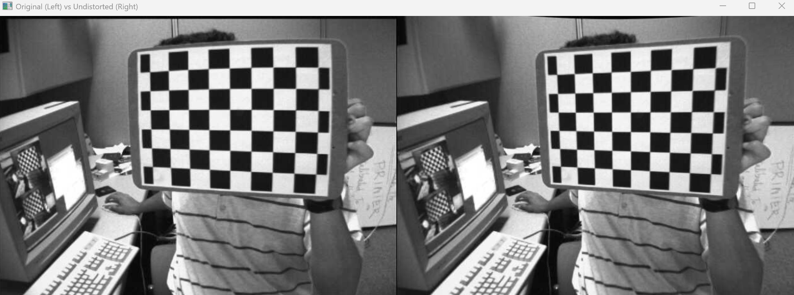
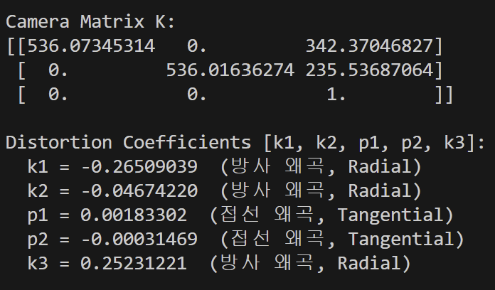
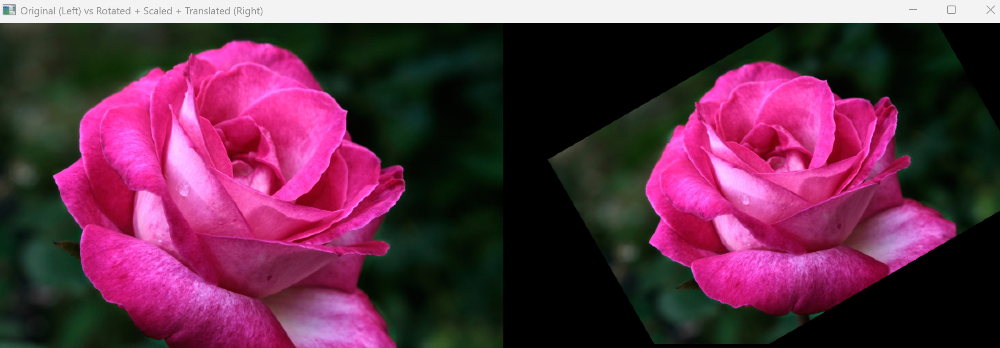
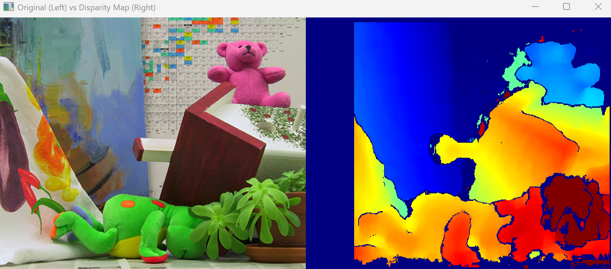
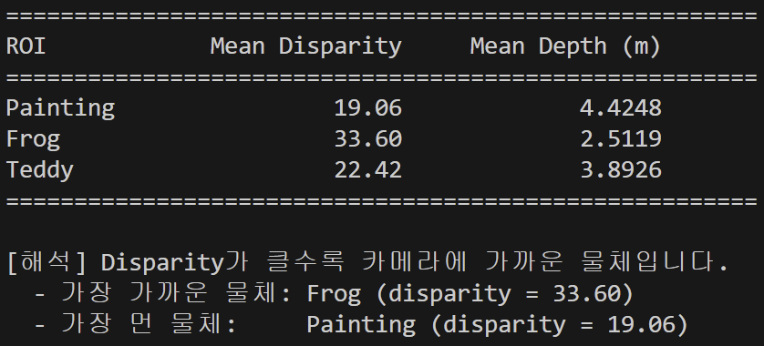

# L02 실습 - 컴퓨터 비전 과제

---

## 과제 1. 카메라 캘리브레이션 및 왜곡 보정 (1.py)

체스보드 패턴 이미지를 이용하여 카메라 내부 파라미터(K)와 왜곡 계수를 구하고, 왜곡을 보정(Undistort)하는 과제이다.

### 전체 코드

체스보드 이미지 13장에서 코너를 검출하고, 3D-2D 좌표 매핑을 통해 카메라를 캘리브레이션한 뒤, 왜곡 보정 결과를 원본과 비교하여 시각화하는 전체 파이프라인이다.

```python
import cv2          # OpenCV 라이브러리 임포트
import numpy as np  # 수치 계산용 numpy 임포트
import glob         # 파일 경로 패턴 매칭용 glob 임포트

CHECKERBOARD = (9, 6)  # 체크보드 내부 코너 개수 (가로 9, 세로 6)

square_size = 25.0  # 체크보드 한 칸의 실제 크기 (mm)

criteria = (cv2.TERM_CRITERIA_EPS + cv2.TERM_CRITERIA_MAX_ITER, 30, 0.001)  # 코너 정밀화 종료 조건 (정밀도 or 최대 반복)

objp = np.zeros((CHECKERBOARD[0] * CHECKERBOARD[1], 3), np.float32)  # 체크보드 코너의 3D 좌표를 담을 배열 생성 (54개 점, z=0)
objp[:, :2] = np.mgrid[0:CHECKERBOARD[0], 0:CHECKERBOARD[1]].T.reshape(-1, 2)  # x, y 좌표를 격자 형태로 채움
objp *= square_size  # 실제 크기(25mm)를 곱하여 실세계 좌표로 변환

objpoints = []  # 모든 이미지의 3D 실세계 좌표를 저장할 리스트
imgpoints = []  # 모든 이미지의 2D 이미지 좌표를 저장할 리스트

images = glob.glob("images/calibration_images/left*.jpg")  # 캘리브레이션용 체크보드 이미지 파일 목록 가져오기

img_size = None  # 이미지 크기 저장용 변수 초기화

# -----------------------------
# 1. 체크보드 코너 검출
# -----------------------------
for fname in images:  # 각 이미지 파일에 대해 반복
    img = cv2.imread(fname)  # 이미지 파일 읽기
    gray = cv2.cvtColor(img, cv2.COLOR_BGR2GRAY)  # 그레이스케일로 변환

    if img_size is None:  # 첫 이미지에서 크기 저장
        img_size = (gray.shape[1], gray.shape[0])  # (너비, 높이) 형태로 저장

    ret, corners = cv2.findChessboardCorners(gray, CHECKERBOARD, None)  # 체크보드 코너 검출 시도

    if ret:  # 코너 검출 성공 시
        objpoints.append(objp)  # 해당 이미지의 3D 좌표 추가
        corners2 = cv2.cornerSubPix(gray, corners, (11, 11), (-1, -1), criteria)  # 서브픽셀 정밀도로 코너 위치 보정
        imgpoints.append(corners2)  # 보정된 2D 코너 좌표 추가
        print(f"[OK] {fname} - 코너 검출 성공")  # 성공 메시지 출력
    else:  # 코너 검출 실패 시
        print(f"[SKIP] {fname} - 코너 검출 실패")  # 실패 메시지 출력

print(f"\n총 {len(imgpoints)}장의 이미지에서 코너 검출 완료\n")  # 검출 완료된 이미지 수 출력

# -----------------------------
# 2. 카메라 캘리브레이션
# -----------------------------
ret, K, dist, rvecs, tvecs = cv2.calibrateCamera(objpoints, imgpoints, img_size, None, None)  # 3D-2D 매핑으로 카메라 내부 파라미터 계산

print("Camera Matrix K:")  # 카메라 내부 행렬 출력 안내
print(K)  # 3x3 카메라 내부 행렬 (초점거리, 주점 포함) 출력

print("\nDistortion Coefficients [k1, k2, p1, p2, k3]:")  # 왜곡 계수 출력 안내
k1, k2, p1, p2, k3 = dist[0][:5]
print(f"  k1 = {k1:.8f}  (방사 왜곡, Radial)")
print(f"  k2 = {k2:.8f}  (방사 왜곡, Radial)")
print(f"  p1 = {p1:.8f}  (접선 왜곡, Tangential)")
print(f"  p2 = {p2:.8f}  (접선 왜곡, Tangential)")
print(f"  k3 = {k3:.8f}  (방사 왜곡, Radial)")

print(f"\nRe-projection Error (RMS): {ret:.4f}")  # 재투영 오차 출력 (낮을수록 정확)

# -----------------------------
# 3. 왜곡 보정 시각화
# -----------------------------
sample_img = cv2.imread(images[0])  # 첫 번째 이미지를 샘플로 읽기
h, w = sample_img.shape[:2]  # 이미지의 높이, 너비 가져오기

new_K, roi = cv2.getOptimalNewCameraMatrix(K, dist, (w, h), 1, (w, h))  # 왜곡 보정 후 최적 카메라 행렬과 유효 ROI 계산

undistorted = cv2.undistort(sample_img, K, dist, None, new_K)  # 왜곡 보정 적용하여 이미지 펴기

x, y, w_roi, h_roi = roi  # 유효 영역(ROI) 좌표 추출
if w_roi > 0 and h_roi > 0:  # 유효 ROI가 존재하면
    undistorted = undistorted[y:y + h_roi, x:x + w_roi]  # 보정 이미지를 ROI로 크롭
    sample_img_resized = cv2.resize(sample_img, (w_roi, h_roi))  # 원본도 같은 크기로 리사이즈
else:  # ROI가 없으면
    sample_img_resized = sample_img  # 원본 그대로 사용

combined = np.hstack([sample_img_resized, undistorted])  # 원본과 보정 이미지를 좌우로 이어 붙이기

cv2.imshow("Original (Left) vs Undistorted (Right)", combined)  # 비교 이미지 화면에 표시
print("\n원본(좌)과 왜곡 보정(우) 이미지를 비교합니다. 아무 키나 누르면 종료합니다.")  # 안내 메시지 출력
cv2.waitKey(0)  # 키 입력 대기
cv2.destroyAllWindows()  # 모든 창 닫기
```

### 핵심 코드

**1) 체크보드 코너 검출**

`cv2.findChessboardCorners()`로 각 이미지에서 체크보드의 내부 코너(9×6 = 54개)를 자동으로 찾아낸다. 검출된 코너는 `cv2.cornerSubPix()`를 통해 서브픽셀 수준의 정밀한 위치로 보정된다.

```python
ret, corners = cv2.findChessboardCorners(gray, CHECKERBOARD, None)
corners2 = cv2.cornerSubPix(gray, corners, (11, 11), (-1, -1), criteria)
```

**2) 카메라 캘리브레이션**

3D 실세계 좌표(objpoints)와 2D 이미지 좌표(imgpoints)의 대응 관계를 이용하여 카메라 내부 행렬(K)과 왜곡 계수(dist)를 계산한다. K에는 초점거리(fx, fy)와 주점(cx, cy)이 포함된다.

```python
ret, K, dist, rvecs, tvecs = cv2.calibrateCamera(objpoints, imgpoints, img_size, None, None)
```

**3) 왜곡 보정 (Undistort)**

`cv2.undistort()`로 렌즈 왜곡(방사 왜곡 + 접선 왜곡)을 제거하여 곧은 직선이 유지되는 보정된 이미지를 생성한다.

```python
new_K, roi = cv2.getOptimalNewCameraMatrix(K, dist, (w, h), 1, (w, h))
undistorted = cv2.undistort(sample_img, K, dist, None, new_K)
```
최종 결과


카메라내부파라미터행렬[3x3]와 왜곡계수[k1, k2, p1, p2, k3]

---

## 과제 2. 기하학적 변환 (2.py)

이미지에 회전(Rotation), 크기 조절(Scaling), 이동(Translation) 등 기하학적 변환을 적용하는 과제이다.

### 전체 코드

원본 이미지를 불러와 중심 기준 45° 회전 + 0.7배 축소를 수행한 뒤, x방향 50px·y방향 30px 이동 변환을 추가 적용하고, 원본과 결과를 나란히 비교하여 시각화하는 코드이다.

```python
import cv2          # OpenCV 라이브러리 임포트
import numpy as np  # 수치 계산용 numpy 임포트

# -----------------------------
# 1. 이미지 불러오기
# -----------------------------
img = cv2.imread("images/rose.png")  # 원본 이미지 파일 읽기
if img is None:  # 이미지 로드 실패 시
    raise FileNotFoundError("images/rose.png 파일을 찾을 수 없습니다.")  # 에러 발생

h, w = img.shape[:2]  # 이미지의 높이(h), 너비(w) 가져오기

# -----------------------------
# 2. 회전(Rotation) + 크기 조절(Scaling)
# -----------------------------
angle = 30        # 회전 각도 30도
scale = 0.8       # 크기를 0.8배로 축소

center = (w // 2, h // 2)  # 이미지 중심 좌표 계산
M_rotate = cv2.getRotationMatrix2D(center, angle, scale)  # 중심 기준 회전+크기조절 변환 행렬 생성 (2x3)

rotated_scaled = cv2.warpAffine(img, M_rotate, (w, h))  # 변환 행렬을 적용하여 회전+크기조절 수행

# -----------------------------
# 3. 이동(Translation)
# -----------------------------
tx, ty = 80, -40  # x방향 +80px, y방향 -40px 이동량 설정

M_translate = np.float32([[1, 0, tx],   # 이동 변환 행렬 생성 (2x3)
                           [0, 1, ty]])  # [[1,0,tx],[0,1,ty]] 형태

transformed = cv2.warpAffine(rotated_scaled, M_translate, (w, h))  # 회전+크기조절된 이미지에 이동 변환 적용

# -----------------------------
# 4. 시각화: 원본 vs 최종 변환 결과
# -----------------------------
combined = np.hstack([img, transformed])  # 원본과 변환 결과를 좌우로 이어 붙이기

max_width = 1200  # 표시할 최대 너비 설정
ch, cw = combined.shape[:2]  # 합친 이미지의 높이, 너비 가져오기
if cw > max_width:  # 최대 너비 초과 시
    ratio = max_width / cw  # 축소 비율 계산
    combined = cv2.resize(combined, (max_width, int(ch * ratio)))  # 비율에 맞게 리사이즈

cv2.imshow("Original (Left) vs Rotated + Scaled + Translated (Right)", combined)  # 비교 이미지 화면에 표시
print("원본(좌)과 변환 결과(우)를 비교합니다. 아무 키나 누르면 종료합니다.")  # 안내 메시지 출력
cv2.waitKey(0)  # 키 입력 대기
cv2.destroyAllWindows()  # 모든 창 닫기
```

### 핵심 코드

**1) 회전 + 크기 조절 변환 행렬 생성**

`cv2.getRotationMatrix2D()`로 이미지 중심을 기준으로 30° 회전과 0.8배 축소를 동시에 수행하는 2×3 아핀 변환 행렬을 생성한다. `cv2.warpAffine()`으로 이 행렬을 이미지에 적용한다.

```python
center = (w // 2, h // 2)
M_rotate = cv2.getRotationMatrix2D(center, angle, scale)
rotated_scaled = cv2.warpAffine(img, M_rotate, (w, h))
```

**2) 이동(Translation) 변환 행렬**

2×3 이동 변환 행렬을 직접 구성하여 x축 80px, y축 -400px만큼 이미지를 평행이동시킨다. 이전 단계의 회전+축소 결과에 이어서 적용한다.

```python
M_translate = np.float32([[1, 0, tx],
                           [0, 1, ty]])
transformed = cv2.warpAffine(rotated_scaled, M_translate, (w, h))
```


---

## 과제 3. 스테레오 깊이 추정 (3.py)

좌/우 스테레오 이미지로부터 Disparity Map을 구하고, 깊이(Depth)를 추정하여 물체의 원근 관계를 분석하는 과제이다.

### 전체 코드

좌/우 이미지를 그레이스케일로 변환한 뒤 StereoBM으로 Disparity를 계산하고, Z = fB/d 공식으로 Depth를 구한다. 3개 ROI(Painting, Frog, Teddy)의 평균 Disparity/Depth를 비교하여 가장 가까운/먼 물체를 판별하고, JET 컬러맵으로 시각화하는 코드이다.

```python
import cv2          # OpenCV 라이브러리 임포트
import numpy as np  # 수치 계산용 numpy 임포트
from pathlib import Path  # 경로 처리용 pathlib 임포트

output_dir = Path("./outputs")  # 출력 폴더 경로 설정
output_dir.mkdir(parents=True, exist_ok=True)  # 출력 폴더가 없으면 생성

# -----------------------------
# 좌/우 이미지 불러오기
# -----------------------------
left_color = cv2.imread("images/left.png")   # 스테레오 왼쪽 이미지 읽기
right_color = cv2.imread("images/right.png")  # 스테레오 오른쪽 이미지 읽기

if left_color is None or right_color is None:  # 이미지 로드 실패 시
    raise FileNotFoundError("좌/우 이미지를 찾지 못했습니다.")  # 에러 발생

f = 700.0    # 카메라 초점 거리 (픽셀 단위)
B = 0.12     # 두 카메라 사이 거리, 베이스라인 (미터)

rois = {  # 관심 영역(ROI) 설정 (x, y, 너비, 높이)
    "Painting": (55, 50, 130, 110),   # 그림 영역
    "Frog": (90, 265, 230, 95),       # 개구리 영역
    "Teddy": (310, 35, 115, 90)       # 곰인형 영역
}

left_gray = cv2.cvtColor(left_color, cv2.COLOR_BGR2GRAY)   # 왼쪽 이미지를 그레이스케일로 변환
right_gray = cv2.cvtColor(right_color, cv2.COLOR_BGR2GRAY)  # 오른쪽 이미지를 그레이스케일로 변환

# -----------------------------
# 1. Disparity 계산
# -----------------------------
stereo = cv2.StereoBM_create(numDisparities=64, blockSize=15)  # StereoBM 매칭 객체 생성 (탐색범위 64, 블록크기 15)
disparity_raw = stereo.compute(left_gray, right_gray)  # 좌우 이미지로 disparity 계산 (16배 스케일 정수)

disparity = disparity_raw.astype(np.float32) / 16.0  # 16배 스케일을 나눠 실제 disparity 값으로 변환

# -----------------------------
# 2. Depth 계산 (Z = fB / d)
# Disparity > 0인 픽셀만 필터링
# -----------------------------
valid_mask = disparity > 0  # 유효한 disparity (양수)인 픽셀 마스크 생성
depth_map = np.zeros_like(disparity)  # depth 맵을 0으로 초기화
depth_map[valid_mask] = (f * B) / disparity[valid_mask]  # Z = fB/d 공식으로 깊이 계산

# -----------------------------
# 3. ROI별 평균 disparity / depth 계산
# -----------------------------
results = {}  # 결과 저장용 딕셔너리
for name, (x, y, w, h) in rois.items():  # 각 ROI에 대해 반복
    roi_disp = disparity[y:y + h, x:x + w]  # ROI 영역의 disparity 추출
    roi_depth = depth_map[y:y + h, x:x + w]  # ROI 영역의 depth 추출
    roi_valid = roi_disp > 0  # ROI 내 유효한 픽셀 마스크

    if np.any(roi_valid):  # 유효한 픽셀이 있으면
        mean_disp = np.mean(roi_disp[roi_valid])   # 유효 픽셀의 평균 disparity 계산
        mean_depth = np.mean(roi_depth[roi_valid])  # 유효 픽셀의 평균 depth 계산
    else:  # 유효 픽셀이 없으면
        mean_disp = 0.0   # 평균 disparity를 0으로 설정
        mean_depth = 0.0  # 평균 depth를 0으로 설정

    results[name] = {"mean_disparity": mean_disp, "mean_depth": mean_depth}  # 결과 저장

# -----------------------------
# 4. 결과 출력
# -----------------------------
print("=" * 55)  # 구분선 출력
print(f"{'ROI':<12} {'Mean Disparity':>16} {'Mean Depth (m)':>18}")  # 테이블 헤더 출력
print("=" * 55)  # 구분선 출력
for name, vals in results.items():  # 각 ROI 결과 반복 출력
    print(f"{name:<12} {vals['mean_disparity']:>16.2f} {vals['mean_depth']:>18.4f}")  # ROI명, 평균 disparity, 평균 depth 출력
print("=" * 55)  # 구분선 출력

closest = max(results, key=lambda k: results[k]["mean_disparity"])   # disparity가 가장 큰 (가장 가까운) ROI 찾기
farthest = min(results, key=lambda k: results[k]["mean_disparity"])  # disparity가 가장 작은 (가장 먼) ROI 찾기

print(f"\n[해석] Disparity가 클수록 카메라에 가까운 물체입니다.")  # 해석 원리 설명
print(f"  - 가장 가까운 물체: {closest} (disparity = {results[closest]['mean_disparity']:.2f})")  # 가장 가까운 물체 출력
print(f"  - 가장 먼 물체:     {farthest} (disparity = {results[farthest]['mean_disparity']:.2f})")  # 가장 먼 물체 출력

# -----------------------------
# 5. Disparity 시각화
# -----------------------------
disp_tmp = disparity.copy()  # disparity 배열 복사
disp_tmp[disp_tmp <= 0] = np.nan  # 유효하지 않은 값(0 이하)을 NaN으로 설정

if np.all(np.isnan(disp_tmp)):  # 모든 값이 NaN이면
    raise ValueError("유효한 disparity 값이 없습니다.")  # 에러 발생

d_min = np.nanpercentile(disp_tmp, 5)   # 하위 5% 값 (최솟값 기준)
d_max = np.nanpercentile(disp_tmp, 95)  # 상위 95% 값 (최댓값 기준)

if d_max <= d_min:  # 최대-최소 차이가 없으면
    d_max = d_min + 1e-6  # 미세한 차이 추가 (0 나누기 방지)

disp_scaled = (disp_tmp - d_min) / (d_max - d_min)  # 0~1 범위로 정규화
disp_scaled = np.clip(disp_scaled, 0, 1)  # 0~1 범위로 클리핑

disp_vis = np.zeros_like(disparity, dtype=np.uint8)  # 시각화용 8비트 배열 생성
valid_disp = ~np.isnan(disp_tmp)  # 유효한 값 마스크
disp_vis[valid_disp] = (disp_scaled[valid_disp] * 255).astype(np.uint8)  # 0~255 범위로 변환

disparity_color = cv2.applyColorMap(disp_vis, cv2.COLORMAP_JET)  # JET 컬러맵 적용 (빨강=가까움, 파랑=멀음)

# -----------------------------
# 6. Depth 시각화
# -----------------------------
depth_vis = np.zeros_like(depth_map, dtype=np.uint8)  # 시각화용 8비트 배열 생성

if np.any(valid_mask):  # 유효한 depth 값이 있으면
    depth_valid = depth_map[valid_mask]  # 유효한 depth 값 추출

    z_min = np.percentile(depth_valid, 5)   # 하위 5% depth 값
    z_max = np.percentile(depth_valid, 95)  # 상위 95% depth 값

    if z_max <= z_min:  # 최대-최소 차이가 없으면
        z_max = z_min + 1e-6  # 미세한 차이 추가

    depth_scaled = (depth_map - z_min) / (z_max - z_min)  # 0~1 범위로 정규화
    depth_scaled = np.clip(depth_scaled, 0, 1)  # 0~1 범위로 클리핑

    depth_scaled = 1.0 - depth_scaled  # 반전 (가까울수록 높은 값 = 빨강)
    depth_vis[valid_mask] = (depth_scaled[valid_mask] * 255).astype(np.uint8)  # 0~255 범위로 변환

depth_color = cv2.applyColorMap(depth_vis, cv2.COLORMAP_JET)  # JET 컬러맵 적용

combined = np.hstack([left_color, disparity_color])  # 원본과 disparity 맵을 좌우로 이어 붙이기

max_width = 1200  # 표시할 최대 너비 설정
ch, cw = combined.shape[:2]  # 합친 이미지의 높이, 너비 가져오기
if cw > max_width:  # 최대 너비 초과 시
    ratio = max_width / cw  # 축소 비율 계산
    combined = cv2.resize(combined, (max_width, int(ch * ratio)))  # 비율에 맞게 리사이즈

cv2.imshow("Original (Left) vs Disparity Map (Right)", combined)  # 비교 이미지 화면에 표시

print("\n시각화 창을 확인하세요. 아무 키나 누르면 종료합니다.")  # 안내 메시지 출력
cv2.waitKey(0)  # 키 입력 대기
cv2.destroyAllWindows()  # 모든 창 닫기

# 결과 이미지 저장
cv2.imwrite(str(output_dir / "disparity_map.png"), disparity_color)
cv2.imwrite(str(output_dir / "depth_map.png"), depth_color)
print("결과 이미지가 outputs/ 폴더에 저장되었습니다.")
```

### 핵심 코드

**1) Disparity 계산**

`cv2.StereoBM_create()`로 블록 매칭 기반 스테레오 매칭 객체를 생성하고, 좌/우 그레이스케일 이미지 간의 Disparity(시차)를 계산한다. StereoBM의 출력은 16배 스케일 정수이므로 16으로 나눠 실수 값으로 변환한다.

```python
stereo = cv2.StereoBM_create(numDisparities=64, blockSize=15)
disparity_raw = stereo.compute(left_gray, right_gray)
disparity = disparity_raw.astype(np.float32) / 16.0
```

**2) Depth 계산 (Z = fB / d)**

Disparity가 양수인 유효 픽셀에 대해서만 깊이 공식 Z = fB/d를 적용한다. f는 초점거리(700px), B는 베이스라인(0.12m), d는 disparity 값이다.

```python
valid_mask = disparity > 0
depth_map = np.zeros_like(disparity)
depth_map[valid_mask] = (f * B) / disparity[valid_mask]
```

**3) ROI별 평균 Disparity / Depth 비교**

미리 지정된 3개의 관심 영역(Painting, Frog, Teddy)에서 평균 Disparity와 평균 Depth를 각각 계산한다. Disparity가 클수록 카메라에 가까운 물체이므로, 이를 기준으로 가장 가까운/먼 물체를 판별한다.

```python
for name, (x, y, w, h) in rois.items():
    roi_disp = disparity[y:y + h, x:x + w]
    roi_depth = depth_map[y:y + h, x:x + w]
    roi_valid = roi_disp > 0
    mean_disp = np.mean(roi_disp[roi_valid])
    mean_depth = np.mean(roi_depth[roi_valid])
```



