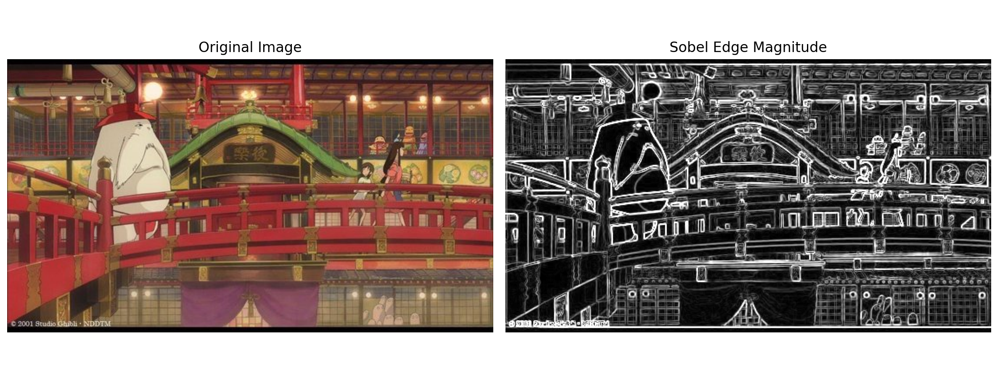
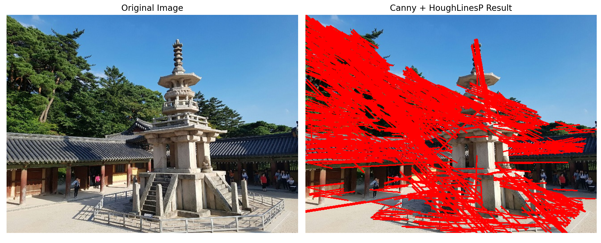
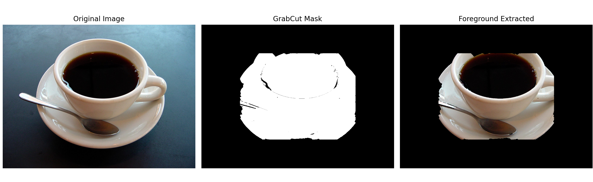

# L03 실습 - 컴퓨터 비전 과제: Edge Detection & Region Segmentation

---

## 과제 1. 소벨 에지 검출 및 결과 시각화 (1.py)

edgeDetectionImage 이미지에 Sobel 필터를 적용하여 x축과 y축 방향의 에지를 검출하고, 에지 강도를 계산 및 시각화하는 과제이다.

### 전체 코드

이미지를 그레이스케일로 변환한 뒤 Sobel 필터를 사용하여 x/y 방향 에지를 각각 계산하고, 두 방향의 에지를 합쳐 에지 강도(magnitude)를 구한 뒤 uint8로 변환하여 원본과 함께 시각화하는 파이프라인이다.

```python
import cv2 as cv  # OpenCV 라이브러리를 불러옴
import numpy as np  # 수치 연산용 NumPy를 불러옴
import matplotlib.pyplot as plt  # 시각화용 Matplotlib를 불러옴

img = cv.imread('edgeDetectionImage.jpg')  # 입력 이미지를 파일에서 읽어옴
if img is None:  # 이미지 로드 실패 여부를 확인함
    raise FileNotFoundError('edgeDetectionImage.jpg 파일을 찾을 수 없습니다.')  # 파일이 없으면 오류를 발생시킴

gray = cv.cvtColor(img, cv.COLOR_BGR2GRAY)  # 컬러 이미지를 그레이스케일로 변환함

sobel_x = cv.Sobel(gray, cv.CV_64F, 1, 0, ksize=3)  # x축 방향 소벨 에지를 계산함
sobel_y = cv.Sobel(gray, cv.CV_64F, 0, 1, ksize=3)  # y축 방향 소벨 에지를 계산함

edge_mag = cv.magnitude(sobel_x, sobel_y)  # x/y 에지를 합쳐 에지 강도를 계산함

edge_uint8 = cv.convertScaleAbs(edge_mag)  # 에지 강도 영상을 uint8로 변환함

img_rgb = cv.cvtColor(img, cv.COLOR_BGR2RGB)  # Matplotlib 표시를 위해 BGR을 RGB로 변환함

plt.figure(figsize=(12, 5))  # 시각화용 Figure 크기를 설정함
plt.subplot(1, 2, 1)  # 첫 번째 서브플롯을 선택함
plt.imshow(img_rgb)  # 원본 이미지를 표시함
plt.title('Original Image')  # 첫 번째 이미지 제목을 설정함
plt.axis('off')  # 축 표시를 숨김

plt.subplot(1, 2, 2)  # 두 번째 서브플롯을 선택함
plt.imshow(edge_uint8, cmap='gray')  # 에지 강도 이미지를 흑백으로 표시함
plt.title('Sobel Edge Magnitude')  # 두 번째 이미지 제목을 설정함
plt.axis('off')  # 축 표시를 숨김

plt.tight_layout()  # 레이아웃이 겹치지 않게 자동 조정함
plt.show()  # 화면에 시각화 결과를 출력함
```

### 핵심 코드

**1) 그레이스케일 변환**

컬러 이미지를 그레이스케일로 변환하여 Sobel 필터 적용에 필요한 단일 채널 이미지를 준비한다.

```python
gray = cv.cvtColor(img, cv.COLOR_BGR2GRAY)
```

**2) Sobel 필터를 이용한 x/y 방향 에지 검출**

`cv.Sobel()`을 사용하여 x축 방향(1, 0)과 y축 방향(0, 1)의 에지를 각각 계산한다. ksize=3은 3×3 커널 크기를 의미하고, cv.CV_64F는 64비트 부동소수점 데이터 타입을 사용한다.

```python
sobel_x = cv.Sobel(gray, cv.CV_64F, 1, 0, ksize=3)  # x축 에지
sobel_y = cv.Sobel(gray, cv.CV_64F, 0, 1, ksize=3)  # y축 에지
```

**3) 에지 강도(Magnitude) 계산**

x축과 y축 에지를 합쳐 전체 에지 강도를 계산한다. `cv.magnitude()`는 두 벡터 성분의 크기를 $\sqrt{x^2 + y^2}$ 공식으로 계산한다.

```python
edge_mag = cv.magnitude(sobel_x, sobel_y)
```

**4) uint8 변환 및 시각화**

에지 강도 이미지를 메모리 효율적인 uint8(0~255) 범위로 변환하여 시각화하기 쉽게 만든다. `cv.convertScaleAbs()`는 절댓값을 취하면서 동시에 스케일링한다.

```python
edge_uint8 = cv.convertScaleAbs(edge_mag)
plt.imshow(edge_uint8, cmap='gray')  # 흑백 컬러맵으로 표시
```
최종결과

---

## 과제 2. 캐니 에지 및 허프 변환을 이용한 직선 검출 (2.py)

dabo 이미지에 캐니 에지 검출(Canny Edge Detection)을 적용한 뒤, 허프 변환(Hough Transform)을 사용하여 직선을 검출하고 원본 이미지에 빨간색으로 표시하는 과제이다.

### 전체 코드

이미지를 그레이스케일로 변환한 뒤 캐니 에지 검출을 수행하고, 확률적 허프 변환(HoughLinesP)으로 직선을 검출하며, 검출된 직선을 원본 이미지에 빨간색으로 그려서 시각화하는 파이프라인이다.

```python
import cv2 as cv  # OpenCV 라이브러리를 불러옴
import numpy as np  # 수치 연산용 NumPy를 불러옴
import matplotlib.pyplot as plt  # 시각화용 Matplotlib를 불러옴

img = cv.imread('dabo.jpg')  # 입력 이미지를 파일에서 읽어옴
if img is None:  # 이미지 로드 실패 여부를 확인함
    raise FileNotFoundError('dabo.jpg 파일을 찾을 수 없습니다.')  # 파일이 없으면 오류를 발생시킴

original_rgb = cv.cvtColor(img, cv.COLOR_BGR2RGB)  # 원본 표시용으로 RGB 변환본을 만듦

gray = cv.cvtColor(img, cv.COLOR_BGR2GRAY)  # 캐니 연산을 위해 그레이스케일로 변환함

edges = cv.Canny(gray, 100, 200)  # 임계값 100/200으로 캐니 에지 맵을 생성함

lines = cv.HoughLinesP(edges, 1, np.pi / 180, 80, minLineLength=50, maxLineGap=10)  # 확률적 허프 변환으로 직선을 검출함

line_img = img.copy()  # 직선을 그릴 복사 이미지를 생성함
if lines is not None:  # 검출된 직선이 있는지 확인함
    for line in lines:  # 검출된 각 직선에 대해 반복함
        x1, y1, x2, y2 = line[0]  # 직선의 시작점과 끝점 좌표를 꺼냄
        cv.line(line_img, (x1, y1), (x2, y2), (0, 0, 255), 2)  # 빨간색 두께 2로 직선을 그림

line_rgb = cv.cvtColor(line_img, cv.COLOR_BGR2RGB)  # Matplotlib 표시를 위해 RGB로 변환함

plt.figure(figsize=(12, 5))  # 시각화용 Figure 크기를 설정함
plt.subplot(1, 2, 1)  # 첫 번째 서브플롯을 선택함
plt.imshow(original_rgb)  # 원본 이미지를 표시함
plt.title('Original Image')  # 첫 번째 이미지 제목을 설정함
plt.axis('off')  # 축 표시를 숨김

plt.subplot(1, 2, 2)  # 두 번째 서브플롯을 선택함
plt.imshow(line_rgb)  # 직선이 그려진 결과 이미지를 표시함
plt.title('Canny + HoughLinesP Result')  # 두 번째 이미지 제목을 설정함
plt.axis('off')  # 축 표시를 숨김

plt.tight_layout()  # 레이아웃이 겹치지 않게 자동 조정함
plt.show()  # 화면에 시각화 결과를 출력함
```

### 핵심 코드

**1) 캐니 에지 검출**

`cv.Canny()`는 이미지에서 가장자리(edge)를 검출하는 고전적인 알고리즘이다. 두 개의 임계값(threshold1=100, threshold2=200)을 사용하여 강한 에지와 약한 에지를 구분한다. 약한 에지 중 강한 에지와 연결된 것만 최종 에지로 선택된다.

```python
edges = cv.Canny(gray, 100, 200)  # threshold1=100, threshold2=200
```

**2) 허프 변환을 이용한 직선 검출**

`cv.HoughLinesP()`는 확률적 허프 변환으로 이미지에서 직선을 검출한다. 주요 파라미터는:
- `rho=1`: 축적 배열의 거리 해상도 (픽셀)
- `theta=np.pi/180`: 축적 배열의 각도 해상도 (라디안, 약 1도)
- `threshold=80`: 임계값 (축적 배열에서 이 이상의 투표를 받은 직선만 반환)
- `minLineLength=50`: 최소 직선 길이
- `maxLineGap=10`: 직선 끝 사이의 최대 간격

```python
lines = cv.HoughLinesP(edges, 1, np.pi / 180, 80, minLineLength=50, maxLineGap=10)
```

**3) 검출된 직선을 이미지에 그리기**

검출된 각 직선의 시작점(x1, y1)과 끝점(x2, y2)을 이용하여 `cv.line()`으로 원본 이미지에 빨간색(0, 0, 255, BGR 형식)과 두께 2로 직선을 그린다.

```python
if lines is not None:
    for line in lines:
        x1, y1, x2, y2 = line[0]
        cv.line(line_img, (x1, y1), (x2, y2), (0, 0, 255), 2)  # 빨간색, 두께 2
```
최종결과

---

## 과제 3. GrabCut을 이용한 대화식 영역 분할 및 객체 추출 (3.py)

coffee cup 이미지에서 사용자가 지정한 사각형 영역을 초기값으로 하여 GrabCut 알고리즘을 실행하고, 전경과 배경을 분할한 뒤 배경을 제거한 객체만 추출하는 과제이다.

### 전체 코드

이미지를 불러온 뒤 사용자가 대화식으로 관심 영역(ROI)을 선택(또는 기본값 적용)하고, GrabCut 알고리즘을 적용하여 전경과 배경을 분할하며, 이진 마스크를 이용해 배경을 제거한 뒤 원본, 마스크, 결과 이미지 3개를 나란히 시각화하는 파이프라인이다.

```python
import cv2 as cv  # OpenCV 라이브러리를 불러옴
import numpy as np  # 수치 연산용 NumPy를 불러옴
import matplotlib.pyplot as plt  # 시각화용 Matplotlib를 불러옴

img = cv.imread('coffee cup.JPG')  # 입력 이미지를 파일에서 읽어옴
if img is None:  # 이미지 로드 실패 여부를 확인함
    raise FileNotFoundError('coffee cup.JPG 파일을 찾을 수 없습니다.')  # 파일이 없으면 오류를 발생시킴

preview = img.copy()  # ROI 선택 창에 보여줄 복사 이미지를 만듦

rect = cv.selectROI('Select ROI for GrabCut', preview, showCrosshair=True, fromCenter=False)  # 사용자가 사각형 ROI를 대화식으로 선택함
cv.destroyWindow('Select ROI for GrabCut')  # ROI 선택 창을 닫음

x, y, w, h = rect  # 선택된 사각형 좌표를 분해함

if w == 0 or h == 0:  # ROI를 선택하지 않았는지 확인함
    h_img, w_img = img.shape[:2]  # 원본 이미지 높이와 너비를 가져옴
    x = int(w_img * 0.2)  # 기본 ROI의 시작 x를 계산함
    y = int(h_img * 0.2)  # 기본 ROI의 시작 y를 계산함
    w = int(w_img * 0.6)  # 기본 ROI의 너비를 계산함
    h = int(h_img * 0.6)  # 기본 ROI의 높이를 계산함
    rect = (x, y, w, h)  # 계산한 기본 ROI를 사각형으로 설정함

mask = np.zeros(img.shape[:2], np.uint8)  # GrabCut용 마스크를 0으로 초기화함
bgdModel = np.zeros((1, 65), np.float64)  # 배경 모델 배열을 초기화함
fgdModel = np.zeros((1, 65), np.float64)  # 전경 모델 배열을 초기화함

cv.grabCut(img, mask, rect, bgdModel, fgdModel, 5, cv.GC_INIT_WITH_RECT)  # 선택한 사각형 기반으로 GrabCut 분할을 수행함

binary_mask = np.where((mask == cv.GC_BGD) | (mask == cv.GC_PR_BGD), 0, 1).astype('uint8')  # 배경/가능배경은 0, 전경/가능전경은 1로 변환함

result = img * binary_mask[:, :, np.newaxis]  # 이진 마스크를 원본에 곱해 배경을 제거함

img_rgb = cv.cvtColor(img, cv.COLOR_BGR2RGB)  # 원본 표시를 위해 RGB로 변환함
result_rgb = cv.cvtColor(result, cv.COLOR_BGR2RGB)  # 결과 표시를 위해 RGB로 변환함

mask_vis = (binary_mask * 255).astype(np.uint8)  # 마스크를 시각화용 0/255 이미지로 변환함

plt.figure(figsize=(15, 5))  # 시각화용 Figure 크기를 설정함

plt.subplot(1, 3, 1)  # 첫 번째 서브플롯을 선택함
plt.imshow(img_rgb)  # 원본 이미지를 표시함
plt.title('Original Image')  # 첫 번째 이미지 제목을 설정함
plt.axis('off')  # 축 표시를 숨김

plt.subplot(1, 3, 2)  # 두 번째 서브플롯을 선택함
plt.imshow(mask_vis, cmap='gray')  # 마스크 이미지를 흑백으로 표시함
plt.title('GrabCut Mask')  # 두 번째 이미지 제목을 설정함
plt.axis('off')  # 축 표시를 숨김

plt.subplot(1, 3, 3)  # 세 번째 서브플롯을 선택함
plt.imshow(result_rgb)  # 배경 제거 결과 이미지를 표시함
plt.title('Foreground Extracted')  # 세 번째 이미지 제목을 설정함
plt.axis('off')  # 축 표시를 숨김

plt.tight_layout()  # 레이아웃이 겹치지 않게 자동 조정함
plt.show()  # 화면에 시각화 결과를 출력함
```

### 핵심 코드

**1) 사용자 대화식 ROI 선택**

`cv.selectROI()`는 이미지 위에서 마우스로 사각형을 그려 관심 영역을 지정하는 대화식 함수이다. 사각형을 선택하지 않으면(w=0, h=0) 기본값으로 이미지 중앙 60% 영역을 사용한다.

```python
rect = cv.selectROI('Select ROI for GrabCut', preview, showCrosshair=True, fromCenter=False)

if w == 0 or h == 0:  # 선택하지 않았다면
    # 기본 ROI를 이미지 중앙 20%~80% 영역으로 설정
    x = int(w_img * 0.2)
    y = int(h_img * 0.2)
    w = int(w_img * 0.6)
    h = int(h_img * 0.6)
```

**2) GrabCut 알고리즘을 이용한 전경/배경 분할**

`cv.grabCut()`는 초기 사각형 영역을 바탕으로 반복적인 최적화를 통해 이미지를 전경(foreground)과 배경(background)으로 분할한다. 5번의 반복(iteration)을 수행하며, `cv.GC_INIT_WITH_RECT`는 초기값으로 사각형 ROI를 사용한다는 의미이다. 결과 마스크는 4개의 값(GC_BGD=0, GC_FGD=1, GC_PR_BGD=2, GC_PR_FGD=3)을 가진다.

```python
bgdModel = np.zeros((1, 65), np.float64)  # 배경 모델 (GMM 계수 저장)
fgdModel = np.zeros((1, 65), np.float64)  # 전경 모델 (GMM 계수 저장)

cv.grabCut(img, mask, rect, bgdModel, fgdModel, 5, cv.GC_INIT_WITH_RECT)
```

**3) 마스크 값을 이진 마스크로 변환**

GrabCut 결과 마스크의 4가지 클래스를 이진(0/1)으로 변환한다. 배경 또는 가능 배경(GC_BGD, GC_PR_BGD)은 0으로, 전경 또는 가능 전경(GC_FGD, GC_PR_FGD)은 1로 변환한다.

```python
binary_mask = np.where((mask == cv.GC_BGD) | (mask == cv.GC_PR_BGD), 0, 1).astype('uint8')
```

**4) 배경 제거 및 객체 추출**

이진 마스크를 원본 이미지에 곱하여 배경을 제거하고 전경(객체) 부분만 남긴다. 마스크는 2D이고 이미지는 3D(3 채널)이므로 `np.newaxis`로 차원을 맞춰야 한다.

```python
result = img * binary_mask[:, :, np.newaxis]  # 배경 픽셀은 [0,0,0], 객체 픽셀은 원래 색상
```
최종결과

