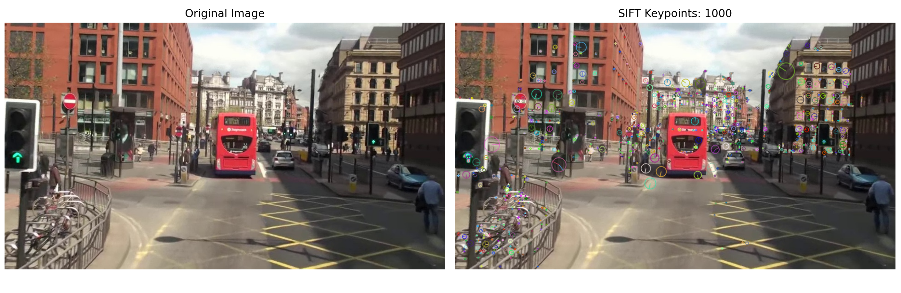
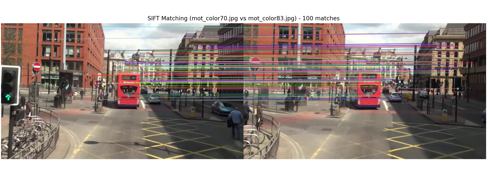
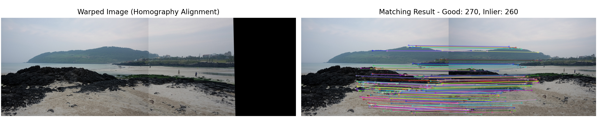

# L04 실습 - 컴퓨터 비전 과제: Local Feature

---

## 과제 1. SIFT를 이용한 특징점 검출 및 시각화 (1.py)

mot_color70.jpg 이미지에서 SIFT 특징점을 검출하고, 특징점의 위치/크기/방향 정보를 시각화하는 과제이다.

### 간단한 설명

이미지를 그레이스케일로 변환한 뒤 SIFT로 특징점과 기술자를 계산하고, 풍부한 키포인트 표시 옵션으로 특징점을 그린 결과를 원본과 나란히 시각화한다.

### 전체 코드

```python
import cv2 as cv  # OpenCV를 불러옵니다.
import matplotlib.pyplot as plt  # 시각화용 matplotlib을 불러옵니다.

image_path = "mot_color70.jpg"  # 입력 이미지 파일명을 지정합니다.
image_bgr = cv.imread(image_path)  # 이미지를 BGR 형식으로 읽습니다.

if image_bgr is None:  # 이미지 로드 실패 여부를 확인합니다.
    raise FileNotFoundError(f"이미지를 찾을 수 없습니다: {image_path}")  # 파일 없음 예외를 발생시킵니다.

gray = cv.cvtColor(image_bgr, cv.COLOR_BGR2GRAY)  # 특징점 검출을 위해 그레이스케일로 변환합니다.
sift = cv.SIFT_create(nfeatures=1000)  # SIFT 객체를 생성하고 최대 특징점 수를 제한합니다.
keypoints, descriptors = sift.detectAndCompute(gray, None)  # 특징점과 기술자를 계산합니다.

vis_bgr = cv.drawKeypoints(  # 특징점 정보를 원본 이미지 위에 그립니다.
    image_bgr,  # 원본 BGR 이미지를 전달합니다.
    keypoints,  # 검출된 특징점 목록을 전달합니다.
    None,  # 결과 이미지를 새로 생성하도록 설정합니다.
    flags=cv.DRAW_MATCHES_FLAGS_DRAW_RICH_KEYPOINTS,  # 특징점의 크기와 방향까지 표시합니다.
)  # 특징점 시각화 결과를 생성합니다.

image_rgb = cv.cvtColor(image_bgr, cv.COLOR_BGR2RGB)  # 원본 이미지를 RGB로 변환합니다.
vis_rgb = cv.cvtColor(vis_bgr, cv.COLOR_BGR2RGB)  # 특징점 이미지를 RGB로 변환합니다.

plt.figure(figsize=(14, 6))  # 출력 창 크기를 설정합니다.

plt.subplot(1, 2, 1)  # 왼쪽 서브플롯을 선택합니다.
plt.imshow(image_rgb)  # 원본 이미지를 표시합니다.
plt.title("Original Image")  # 왼쪽 제목을 설정합니다.
plt.axis("off")  # 축을 숨깁니다.

plt.subplot(1, 2, 2)  # 오른쪽 서브플롯을 선택합니다.
plt.imshow(vis_rgb)  # 특징점 시각화 이미지를 표시합니다.
plt.title(f"SIFT Keypoints: {len(keypoints)}")  # 특징점 개수를 제목에 표시합니다.
plt.axis("off")  # 축을 숨깁니다.

plt.tight_layout()  # 서브플롯 간 간격을 자동 조정합니다.
plt.show()  # 화면에 결과를 출력합니다.
```

### 핵심 코드

**1) SIFT 특징점/기술자 계산**

SIFT 객체를 생성한 뒤 `detectAndCompute()`로 특징점(`keypoints`)과 기술자(`descriptors`)를 동시에 계산한다.

```python
sift = cv.SIFT_create(nfeatures=400)
keypoints, descriptors = sift.detectAndCompute(gray, None)
```

**2) 특징점 시각화**

`cv.drawKeypoints()`에 `DRAW_RICH_KEYPOINTS` 플래그를 사용하면 점의 위치뿐 아니라 크기와 방향까지 함께 확인할 수 있다.

```python
vis_bgr = cv.drawKeypoints(
    image_bgr,
    keypoints,
    None,
    flags=cv.DRAW_MATCHES_FLAGS_DRAW_RICH_KEYPOINTS,
)
```
최종결과

---

## 과제 2. SIFT를 이용한 두 영상 간 특징점 매칭 (2.py)

mot_color70.jpg와 두 번째 이미지(mot_color80.jpg 또는 mot_color83.jpg) 사이에서 SIFT 특징점 매칭을 수행하고 결과를 시각화하는 과제이다.

### 간단한 설명

두 이미지를 불러와 SIFT 특징점을 계산하고, BFMatcher(L2, crossCheck=True)로 매칭한 뒤 거리 기준 상위 매칭을 추려 drawMatches로 출력한다.

### 전체 코드

```python
import os  # 파일 존재 여부 확인을 위해 os를 불러옵니다.
import cv2 as cv  # OpenCV를 불러옵니다.
import matplotlib.pyplot as plt  # 시각화용 matplotlib을 불러옵니다.

image1_path = "mot_color70.jpg"  # 첫 번째 이미지 경로를 지정합니다.
image2_candidates = ["mot_color80.jpg", "mot_color83.jpg"]  # 두 번째 이미지 후보 목록을 지정합니다.
image2_path = next((p for p in image2_candidates if os.path.exists(p)), None)  # 존재하는 파일을 우선 선택합니다.

if image2_path is None:  # 두 번째 이미지가 없으면 예외 처리합니다.
    raise FileNotFoundError("mot_color80.jpg 또는 mot_color83.jpg 파일이 필요합니다.")  # 파일 없음 예외를 발생시킵니다.

img1_bgr = cv.imread(image1_path)  # 첫 번째 이미지를 읽습니다.
img2_bgr = cv.imread(image2_path)  # 두 번째 이미지를 읽습니다.

if img1_bgr is None:  # 첫 번째 이미지 로드 실패 여부를 확인합니다.
    raise FileNotFoundError(f"이미지를 찾을 수 없습니다: {image1_path}")  # 파일 없음 예외를 발생시킵니다.
if img2_bgr is None:  # 두 번째 이미지 로드 실패 여부를 확인합니다.
    raise FileNotFoundError(f"이미지를 찾을 수 없습니다: {image2_path}")  # 파일 없음 예외를 발생시킵니다.

gray1 = cv.cvtColor(img1_bgr, cv.COLOR_BGR2GRAY)  # 첫 번째 이미지를 그레이스케일로 변환합니다.
gray2 = cv.cvtColor(img2_bgr, cv.COLOR_BGR2GRAY)  # 두 번째 이미지를 그레이스케일로 변환합니다.

sift = cv.SIFT_create(nfeatures=600)  # SIFT 객체를 생성합니다.
kp1, des1 = sift.detectAndCompute(gray1, None)  # 첫 번째 이미지의 특징점과 기술자를 계산합니다.
kp2, des2 = sift.detectAndCompute(gray2, None)  # 두 번째 이미지의 특징점과 기술자를 계산합니다.

if des1 is None or des2 is None:  # 기술자 계산 실패 여부를 확인합니다.
    raise RuntimeError("특징점 기술자 계산에 실패했습니다.")  # 계산 실패 예외를 발생시킵니다.

matcher = cv.BFMatcher(cv.NORM_L2, crossCheck=True)  # L2 거리 기반 BFMatcher를 생성합니다.
matches = matcher.match(des1, des2)  # 두 영상의 특징점을 매칭합니다.
matches = sorted(matches, key=lambda m: m.distance)  # 거리 기준 오름차순으로 정렬합니다.

max_draw = min(100, len(matches))  # 너무 많은 매칭을 방지하기 위해 표시 개수를 제한합니다.
match_vis_bgr = cv.drawMatches(  # 매칭 결과를 한 장의 이미지로 그립니다.
    img1_bgr,  # 첫 번째 원본 이미지를 전달합니다.
    kp1,  # 첫 번째 이미지 특징점을 전달합니다.
    img2_bgr,  # 두 번째 원본 이미지를 전달합니다.
    kp2,  # 두 번째 이미지 특징점을 전달합니다.
    matches[:max_draw],  # 상위 매칭만 시각화합니다.
    None,  # 결과 이미지를 새로 생성합니다.
    flags=cv.DrawMatchesFlags_NOT_DRAW_SINGLE_POINTS,  # 매칭되지 않은 점은 생략합니다.
)  # 매칭 시각화 이미지를 생성합니다.

match_vis_rgb = cv.cvtColor(match_vis_bgr, cv.COLOR_BGR2RGB)  # matplotlib 출력을 위해 RGB로 변환합니다.

plt.figure(figsize=(16, 7))  # 출력 창 크기를 설정합니다.
plt.imshow(match_vis_rgb)  # 매칭 결과 이미지를 표시합니다.
plt.title(f"SIFT Matching ({os.path.basename(image1_path)} vs {os.path.basename(image2_path)}) - {max_draw} matches")  # 제목에 파일명과 매칭 수를 표시합니다.
plt.axis("off")  # 축을 숨깁니다.
plt.tight_layout()  # 레이아웃을 정리합니다.
plt.show()  # 화면에 결과를 출력합니다.
```

### 핵심 코드

**1) BFMatcher 기반 1:1 매칭**

`BFMatcher(cv.NORM_L2, crossCheck=True)`를 사용하면 양방향으로 일치하는 비교적 신뢰도 높은 매칭을 쉽게 얻을 수 있다.

```python
matcher = cv.BFMatcher(cv.NORM_L2, crossCheck=True)
matches = matcher.match(des1, des2)
matches = sorted(matches, key=lambda m: m.distance)
```

**2) 매칭 결과 시각화**

`cv.drawMatches()`로 두 이미지와 매칭선을 한 화면에 그린다. 너무 많은 선은 가독성이 떨어지므로 상위 일부만 표시한다.

```python
max_draw = min(100, len(matches))
match_vis_bgr = cv.drawMatches(
    img1_bgr,
    kp1,
    img2_bgr,
    kp2,
    matches[:max_draw],
    None,
    flags=cv.DrawMatchesFlags_NOT_DRAW_SINGLE_POINTS,
)
```
최종결과

---

## 과제 3. 호모그래피를 이용한 이미지 정합 (3.py)

두 이미지(img1.jpg, img2.jpg)에서 SIFT 대응점을 찾고, 호모그래피를 계산해 한 이미지를 다른 이미지 좌표계로 정렬하는 과제이다.

### 간단한 설명

SIFT 특징점 매칭을 knn + 비율 테스트로 정제한 뒤 RANSAC으로 호모그래피를 추정하고, warpPerspective로 정합 이미지를 생성하여 매칭 결과와 함께 출력한다.

### 전체 코드

```python
import cv2 as cv  # OpenCV를 불러옵니다.
import numpy as np  # 행렬 연산을 위해 NumPy를 불러옵니다.
import matplotlib.pyplot as plt  # 시각화용 matplotlib을 불러옵니다.

base_path = "img1.jpg"  # 기준 이미지 경로를 지정합니다.
warp_path = "img2.jpg"  # 정합할 이미지 경로를 지정합니다.

base_bgr = cv.imread(base_path)  # 기준 이미지를 읽습니다.
warp_bgr = cv.imread(warp_path)  # 정합할 이미지를 읽습니다.

if base_bgr is None:  # 기준 이미지 로드 실패 여부를 확인합니다.
    raise FileNotFoundError(f"이미지를 찾을 수 없습니다: {base_path}")  # 파일 없음 예외를 발생시킵니다.
if warp_bgr is None:  # 정합 이미지 로드 실패 여부를 확인합니다.
    raise FileNotFoundError(f"이미지를 찾을 수 없습니다: {warp_path}")  # 파일 없음 예외를 발생시킵니다.

base_gray = cv.cvtColor(base_bgr, cv.COLOR_BGR2GRAY)  # 기준 이미지를 그레이스케일로 변환합니다.
warp_gray = cv.cvtColor(warp_bgr, cv.COLOR_BGR2GRAY)  # 정합 이미지를 그레이스케일로 변환합니다.

sift = cv.SIFT_create(nfeatures=1200)  # SIFT 객체를 생성합니다.
kp_base, des_base = sift.detectAndCompute(base_gray, None)  # 기준 이미지의 특징점과 기술자를 계산합니다.
kp_warp, des_warp = sift.detectAndCompute(warp_gray, None)  # 정합 이미지의 특징점과 기술자를 계산합니다.

if des_base is None or des_warp is None:  # 기술자 계산 실패 여부를 확인합니다.
    raise RuntimeError("특징점 기술자 계산에 실패했습니다.")  # 계산 실패 예외를 발생시킵니다.

bf = cv.BFMatcher(cv.NORM_L2)  # L2 거리 기반 BFMatcher를 생성합니다.
knn_matches = bf.knnMatch(des_base, des_warp, k=2)  # 각 특징점에 대해 최근접 2개 매칭을 구합니다.

good_matches = []  # 비율 테스트를 통과한 좋은 매칭을 저장할 리스트를 만듭니다.
ratio_thresh = 0.7  # Lowe 비율 테스트 임계값을 설정합니다.
for pair in knn_matches:  # knn 결과를 순회합니다.
    if len(pair) < 2:  # 이웃이 2개 미만인 경우를 제외합니다.
        continue  # 다음 반복으로 이동합니다.
    m, n = pair  # 최근접 매칭과 차최근접 매칭을 분리합니다.
    if m.distance < ratio_thresh * n.distance:  # 비율 테스트를 통과하는지 확인합니다.
        good_matches.append(m)  # 좋은 매칭으로 추가합니다.

if len(good_matches) < 4:  # 호모그래피 계산 최소 조건을 확인합니다.
    raise RuntimeError(f"좋은 매칭 수가 부족합니다: {len(good_matches)}개")  # 매칭 부족 예외를 발생시킵니다.

src_pts = np.float32([kp_warp[m.trainIdx].pt for m in good_matches]).reshape(-1, 1, 2)  # 정합 이미지 좌표를 원본 점으로 구성합니다.
dst_pts = np.float32([kp_base[m.queryIdx].pt for m in good_matches]).reshape(-1, 1, 2)  # 기준 이미지 좌표를 목표 점으로 구성합니다.

H, mask = cv.findHomography(src_pts, dst_pts, cv.RANSAC, 5.0)  # RANSAC으로 호모그래피를 추정합니다.

if H is None or mask is None:  # 호모그래피 계산 성공 여부를 확인합니다.
    raise RuntimeError("호모그래피 계산에 실패했습니다.")  # 계산 실패 예외를 발생시킵니다.

h1, w1 = base_bgr.shape[:2]  # 기준 이미지의 높이와 너비를 구합니다.
h2, w2 = warp_bgr.shape[:2]  # 정합 이미지의 높이와 너비를 구합니다.
pano_w = w1 + w2  # 파노라마 출력 너비를 계산합니다.
pano_h = max(h1, h2)  # 파노라마 출력 높이를 계산합니다.

warped_bgr = cv.warpPerspective(warp_bgr, H, (pano_w, pano_h))  # 정합 이미지를 기준 좌표계로 변환합니다.
warped_bgr[0:h1, 0:w1] = base_bgr  # 기준 이미지를 좌측 상단에 배치합니다.

inlier_mask = mask.ravel().tolist()  # inlier 마스크를 drawMatches용 리스트로 변환합니다.
match_vis_bgr = cv.drawMatches(  # inlier 중심의 매칭 결과를 시각화합니다.
    base_bgr,  # 기준 이미지를 전달합니다.
    kp_base,  # 기준 이미지 특징점을 전달합니다.
    warp_bgr,  # 정합 이미지를 전달합니다.
    kp_warp,  # 정합 이미지 특징점을 전달합니다.
    good_matches,  # 비율 테스트 통과 매칭을 전달합니다.
    None,  # 결과 이미지를 새로 생성합니다.
    matchesMask=inlier_mask,  # RANSAC inlier만 강조하여 표시합니다.
    flags=cv.DrawMatchesFlags_NOT_DRAW_SINGLE_POINTS,  # 단일 점은 표시하지 않습니다.
)  # 매칭 시각화 이미지를 생성합니다.

warped_rgb = cv.cvtColor(warped_bgr, cv.COLOR_BGR2RGB)  # 정합 결과를 RGB로 변환합니다.
match_vis_rgb = cv.cvtColor(match_vis_bgr, cv.COLOR_BGR2RGB)  # 매칭 결과를 RGB로 변환합니다.

plt.figure(figsize=(18, 8))  # 출력 창 크기를 설정합니다.

plt.subplot(1, 2, 1)  # 왼쪽 서브플롯을 선택합니다.
plt.imshow(warped_rgb)  # 정합 결과 이미지를 표시합니다.
plt.title("Warped Image (Homography Alignment)")  # 왼쪽 제목을 설정합니다.
plt.axis("off")  # 축을 숨깁니다.

plt.subplot(1, 2, 2)  # 오른쪽 서브플롯을 선택합니다.
plt.imshow(match_vis_rgb)  # 매칭 결과 이미지를 표시합니다.
plt.title(f"Matching Result - Good: {len(good_matches)}, Inlier: {sum(inlier_mask)}")  # 매칭 통계를 제목에 표시합니다.
plt.axis("off")  # 축을 숨깁니다.

plt.tight_layout()  # 레이아웃을 정리합니다.
plt.show()  # 화면에 결과를 출력합니다.
```

### 핵심 코드

**1) knnMatch + 비율 테스트로 좋은 매칭 선별**

각 특징점의 최근접/차최근접 매칭 거리 비를 비교해 모호한 매칭을 제거한다. 일반적으로 임계값 0.7~0.8을 사용한다.

```python
bf = cv.BFMatcher(cv.NORM_L2)
knn_matches = bf.knnMatch(des_base, des_warp, k=2)

good_matches = []
ratio_thresh = 0.7
for pair in knn_matches:
    if len(pair) < 2:
        continue
    m, n = pair
    if m.distance < ratio_thresh * n.distance:
        good_matches.append(m)
```

**2) RANSAC 기반 호모그래피 계산**

좋은 대응점으로 `cv.findHomography()`를 호출해 두 이미지 간 투시 변환 행렬 H를 추정한다. RANSAC을 사용해 이상치 영향을 줄인다.

```python
src_pts = np.float32([kp_warp[m.trainIdx].pt for m in good_matches]).reshape(-1, 1, 2)
dst_pts = np.float32([kp_base[m.queryIdx].pt for m in good_matches]).reshape(-1, 1, 2)
H, mask = cv.findHomography(src_pts, dst_pts, cv.RANSAC, 5.0)
```

**3) 원근 변환으로 정합 결과 생성**

`cv.warpPerspective()`로 정합 대상 이미지를 기준 좌표계로 변환하고, 파노라마 크기 캔버스에 기준 이미지를 함께 배치한다.

```python
pano_w = w1 + w2
pano_h = max(h1, h2)
warped_bgr = cv.warpPerspective(warp_bgr, H, (pano_w, pano_h))
warped_bgr[0:h1, 0:w1] = base_bgr
```
최종결과
