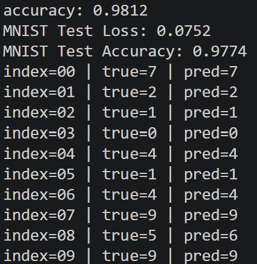
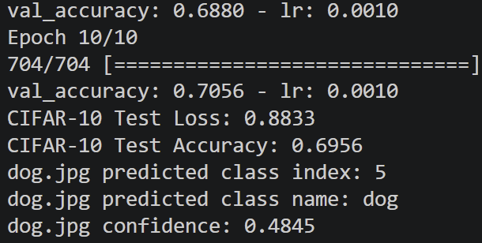

# L05 실습 - 컴퓨터 비전 과제: Image Recognition

---

## 과제 1. MNIST 데이터셋을 이용한 숫자 이미지 분류 (1.py)

MNIST 손글씨 숫자 이미지를 이용하여 0~9 클래스를 분류하는 과제이다.

### 전체 코드

이미지를 정규화한 뒤 28x28 이미지를 1차원 벡터로 펼쳐 다층 퍼셉트론(MLP)으로 학습하고, 테스트셋 성능과 샘플 예측 결과를 출력하는 파이프라인이다.

```python
import numpy as np  # 배열 연산을 위해 NumPy를 불러옵니다.
import tensorflow as tf  # 딥러닝 모델 구성을 위해 TensorFlow를 불러옵니다.

tf.random.set_seed(42)  # 학습 재현성을 위해 TensorFlow 시드를 고정합니다.
np.random.seed(42)  # 학습 재현성을 위해 NumPy 시드를 고정합니다.

(x_train, y_train), (x_test, y_test) = tf.keras.datasets.mnist.load_data()  # MNIST 학습/테스트 데이터를 로드합니다.

x_train = x_train.astype("float32") / 255.0  # 학습 이미지를 float32로 바꾸고 0~1 범위로 정규화합니다.
x_test = x_test.astype("float32") / 255.0  # 테스트 이미지를 float32로 바꾸고 0~1 범위로 정규화합니다.

x_train = x_train.reshape(-1, 28 * 28)  # 학습 이미지를 28x28에서 784차원 벡터로 펼칩니다.
x_test = x_test.reshape(-1, 28 * 28)  # 테스트 이미지를 28x28에서 784차원 벡터로 펼칩니다.

model = tf.keras.Sequential(  # 순차적으로 레이어를 쌓는 모델을 생성합니다.
    [  # 모델 레이어 목록을 정의합니다.
        tf.keras.layers.Input(shape=(784,)),  # 입력 벡터 크기를 784로 지정합니다.
        tf.keras.layers.Dense(256, activation="relu"),  # 첫 번째 은닉층을 ReLU 활성화로 구성합니다.
        tf.keras.layers.Dense(128, activation="relu"),  # 두 번째 은닉층을 ReLU 활성화로 구성합니다.
        tf.keras.layers.Dense(10, activation="softmax"),  # 10개 숫자 클래스를 위한 출력층을 구성합니다.
    ]  # 레이어 목록 정의를 종료합니다.
)  # 모델 생성을 완료합니다.

model.compile(  # 학습을 위한 손실함수와 최적화기를 설정합니다.
    optimizer="adam",  # Adam 최적화기를 사용합니다.
    loss="sparse_categorical_crossentropy",  # 정수 라벨에 맞는 다중분류 손실을 사용합니다.
    metrics=["accuracy"],  # 평가 지표로 정확도를 사용합니다.
)  # 컴파일 설정을 완료합니다.

history = model.fit(  # 모델 학습을 시작합니다.
    x_train,  # 학습 입력 데이터를 전달합니다.
    y_train,  # 학습 정답 라벨을 전달합니다.
    epochs=5,  # 전체 데이터를 5회 반복 학습합니다.
    batch_size=128,  # 배치 크기를 128로 설정합니다.
    validation_split=0.1,  # 학습 데이터의 10%를 검증용으로 분리합니다.
    verbose=1,  # 학습 로그를 출력합니다.
)  # 학습 수행을 완료하고 이력을 저장합니다.

test_loss, test_acc = model.evaluate(x_test, y_test, verbose=0)  # 테스트셋에서 손실과 정확도를 계산합니다.

print(f"MNIST Test Loss: {test_loss:.4f}")  # 테스트 손실을 소수점 4자리로 출력합니다.
print(f"MNIST Test Accuracy: {test_acc:.4f}")  # 테스트 정확도를 소수점 4자리로 출력합니다.

sample_indices = np.arange(10)  # 예시로 확인할 테스트 인덱스 0~9를 생성합니다.
sample_images = x_test[sample_indices]  # 선택한 인덱스의 테스트 이미지를 가져옵니다.
sample_labels = y_test[sample_indices]  # 선택한 인덱스의 정답 라벨을 가져옵니다.

pred_probs = model.predict(sample_images, verbose=0)  # 예시 이미지에 대한 클래스 확률을 예측합니다.
pred_labels = np.argmax(pred_probs, axis=1)  # 확률이 가장 큰 클래스를 최종 예측값으로 변환합니다.

for idx, true_label, pred_label in zip(sample_indices, sample_labels, pred_labels):  # 인덱스, 정답, 예측을 순회합니다.
    print(f"index={idx:02d} | true={true_label} | pred={pred_label}")  # 각 샘플의 정답과 예측을 출력합니다.
```

### 핵심 코드

**1) 이미지 정규화 및 벡터화**

MNIST 이미지를 0~1 범위로 정규화하고, MLP 입력을 위해 28x28 이미지를 784차원 벡터로 펼친다.

```python
x_train = x_train.astype("float32") / 255.0
x_test = x_test.astype("float32") / 255.0

x_train = x_train.reshape(-1, 28 * 28)
x_test = x_test.reshape(-1, 28 * 28)
```

**2) 다층 퍼셉트론 모델 구성**

은닉층 2개와 softmax 출력층을 사용하여 10개 숫자 클래스를 분류한다.

```python
model = tf.keras.Sequential(
    [
        tf.keras.layers.Input(shape=(784,)),
        tf.keras.layers.Dense(256, activation="relu"),
        tf.keras.layers.Dense(128, activation="relu"),
        tf.keras.layers.Dense(10, activation="softmax"),
    ]
)
```

**3) 테스트 성능 평가 및 예측 출력**

학습 완료 후 테스트셋 손실/정확도를 계산하고 샘플 이미지 예측값을 확인한다.

```python
test_loss, test_acc = model.evaluate(x_test, y_test, verbose=0)
print(f"MNIST Test Loss: {test_loss:.4f}")
print(f"MNIST Test Accuracy: {test_acc:.4f}")
```

최종결과


---

## 과제 2. CIFAR-10을 이용한 CNN 이미지 분류 및 dog.jpg 예측 (2.py)

CIFAR-10 데이터셋을 사용해 CNN 모델을 학습하고, 테스트 성능 평가와 dog.jpg 이미지 분류를 수행하는 과제이다.

### 전체 코드

CIFAR-10 데이터를 로드한 뒤 정규화 및 표준화를 수행하고, Conv2D/MaxPooling2D/Flatten/Dense 기반 CNN을 학습한다. 이후 테스트 정확도를 계산하고 dog.jpg에 대한 예측 클래스를 출력한다.

```python
import numpy as np  # 수치 연산을 위해 NumPy를 불러옵니다.
import tensorflow as tf  # 딥러닝 모델 구성을 위해 TensorFlow를 불러옵니다.

tf.random.set_seed(42)  # 학습 재현성을 위해 TensorFlow 시드를 고정합니다.
np.random.seed(42)  # 학습 재현성을 위해 NumPy 시드를 고정합니다.

(x_train, y_train), (x_test, y_test) = tf.keras.datasets.cifar10.load_data()  # CIFAR-10 학습/테스트 데이터를 로드합니다.

x_train = x_train.astype("float32") / 255.0  # 학습 이미지를 float32로 바꾸고 0~1 범위로 정규화합니다.
x_test = x_test.astype("float32") / 255.0  # 테스트 이미지를 float32로 바꾸고 0~1 범위로 정규화합니다.

channel_mean = np.mean(x_train, axis=(0, 1, 2), keepdims=True)  # 학습셋 기준 채널별 평균을 계산합니다.
channel_std = np.std(x_train, axis=(0, 1, 2), keepdims=True) + 1e-7  # 0으로 나눔을 방지하기 위해 작은 값을 더한 표준편차를 계산합니다.

x_train = (x_train - channel_mean) / channel_std  # 학습 이미지를 채널별 표준화합니다.
x_test = (x_test - channel_mean) / channel_std  # 테스트 이미지를 학습셋 통계로 표준화합니다.

data_augmentation = tf.keras.Sequential(  # 학습 시 데이터 다양성을 높이는 증강 파이프라인을 만듭니다.
    [  # 증강 레이어 목록을 정의합니다.
        tf.keras.layers.RandomFlip("horizontal"),  # 좌우 반전을 무작위로 적용합니다.
        tf.keras.layers.RandomTranslation(0.1, 0.1),  # 상하좌우로 최대 10% 이동을 무작위 적용합니다.
        tf.keras.layers.RandomRotation(0.05),  # 작은 각도 회전을 무작위 적용합니다.
    ]  # 증강 레이어 목록 정의를 종료합니다.
)  # 증강 모델 생성을 완료합니다.

model = tf.keras.Sequential(  # 순차적으로 레이어를 쌓는 CNN 모델을 생성합니다.
    [  # 모델 레이어 목록을 정의합니다.
        tf.keras.layers.Input(shape=(32, 32, 3)),  # 입력 이미지 크기를 32x32x3으로 지정합니다.
        data_augmentation,  # 학습 시 증강을 적용해 일반화 성능을 높입니다.
        tf.keras.layers.Conv2D(32, (3, 3), padding="same", use_bias=False),  # 첫 번째 합성곱 레이어를 추가합니다.
        tf.keras.layers.BatchNormalization(),  # 첫 번째 배치정규화를 적용합니다.
        tf.keras.layers.Activation("relu"),  # ReLU 활성화를 적용합니다.
        tf.keras.layers.Conv2D(32, (3, 3), padding="same", use_bias=False),  # 첫 번째 블록의 두 번째 합성곱 레이어를 추가합니다.
        tf.keras.layers.BatchNormalization(),  # 두 번째 배치정규화를 적용합니다.
        tf.keras.layers.Activation("relu"),  # ReLU 활성화를 적용합니다.
        tf.keras.layers.MaxPooling2D((2, 2)),  # 특징맵의 공간 크기를 절반으로 줄입니다.
        tf.keras.layers.Dropout(0.25),  # 과적합을 줄이기 위해 드롭아웃을 적용합니다.
        tf.keras.layers.Conv2D(64, (3, 3), padding="same", use_bias=False),  # 두 번째 합성곱 블록의 첫 번째 레이어를 추가합니다.
        tf.keras.layers.BatchNormalization(),  # 배치정규화를 적용합니다.
        tf.keras.layers.Activation("relu"),  # ReLU 활성화를 적용합니다.
        tf.keras.layers.Conv2D(64, (3, 3), padding="same", use_bias=False),  # 두 번째 블록의 두 번째 합성곱 레이어를 추가합니다.
        tf.keras.layers.BatchNormalization(),  # 배치정규화를 적용합니다.
        tf.keras.layers.Activation("relu"),  # ReLU 활성화를 적용합니다.
        tf.keras.layers.MaxPooling2D((2, 2)),  # 특징맵의 공간 크기를 다시 절반으로 줄입니다.
        tf.keras.layers.Dropout(0.3),  # 과적합을 줄이기 위해 드롭아웃을 적용합니다.
        tf.keras.layers.Conv2D(128, (3, 3), padding="same", use_bias=False),  # 세 번째 합성곱 블록의 첫 번째 레이어를 추가합니다.
        tf.keras.layers.BatchNormalization(),  # 배치정규화를 적용합니다.
        tf.keras.layers.Activation("relu"),  # ReLU 활성화를 적용합니다.
        tf.keras.layers.Conv2D(128, (3, 3), padding="same", use_bias=False),  # 세 번째 블록의 두 번째 합성곱 레이어를 추가합니다.
        tf.keras.layers.BatchNormalization(),  # 배치정규화를 적용합니다.
        tf.keras.layers.Activation("relu"),  # ReLU 활성화를 적용합니다.
        tf.keras.layers.MaxPooling2D((2, 2)),  # 특징맵의 공간 크기를 다시 절반으로 줄입니다.
        tf.keras.layers.Dropout(0.4),  # 과적합을 줄이기 위해 드롭아웃을 적용합니다.
        tf.keras.layers.Flatten(),  # 4차원 특징맵을 1차원 벡터로 펼칩니다.
        tf.keras.layers.Dense(256, activation="relu"),  # 완전연결 은닉층을 추가합니다.
        tf.keras.layers.Dropout(0.5),  # 마지막 과적합 방지를 위해 드롭아웃을 적용합니다.
        tf.keras.layers.Dense(10, activation="softmax"),  # 10개 클래스를 위한 출력층을 추가합니다.
    ]  # 레이어 목록 정의를 종료합니다.
)  # 모델 생성을 완료합니다.

model.compile(  # 학습을 위한 손실함수와 최적화기를 설정합니다.
    optimizer=tf.keras.optimizers.Adam(learning_rate=1e-3),  # Adam 최적화기를 사용합니다.
    loss="sparse_categorical_crossentropy",  # 정수 라벨에 맞는 다중분류 손실을 사용합니다.
    metrics=["accuracy"],  # 평가 지표로 정확도를 사용합니다.
)  # 컴파일 설정을 완료합니다.

callbacks = [  # 학습 제어를 위한 콜백 목록을 정의합니다.
    tf.keras.callbacks.ReduceLROnPlateau(monitor="val_loss", factor=0.5, patience=2, min_lr=1e-5, verbose=1),  # 검증 손실이 정체되면 학습률을 줄입니다.
    tf.keras.callbacks.EarlyStopping(monitor="val_loss", patience=4, restore_best_weights=True, verbose=1),  # 성능 향상이 멈추면 최적 가중치를 복원하고 조기 종료합니다.
]  # 콜백 목록 정의를 종료합니다.

history = model.fit(  # 모델 학습을 시작합니다.
    x_train,  # 학습 입력 데이터를 전달합니다.
    y_train,  # 학습 정답 라벨을 전달합니다.
    epochs=10,  # 전체 데이터를 10회 반복 학습합니다.
    batch_size=64,  # 배치 크기를 64로 설정합니다.
    validation_split=0.1,  # 학습 데이터의 10%를 검증용으로 분리합니다.
    callbacks=callbacks,  # 학습률 스케줄 및 조기종료 콜백을 적용합니다.
    verbose=1,  # 학습 로그를 출력합니다.
)  # 학습 수행을 완료하고 이력을 저장합니다.

test_loss, test_acc = model.evaluate(x_test, y_test, verbose=0)  # 테스트셋에서 손실과 정확도를 계산합니다.

print(f"CIFAR-10 Test Loss: {test_loss:.4f}")  # 테스트 손실을 소수점 4자리로 출력합니다.
print(f"CIFAR-10 Test Accuracy: {test_acc:.4f}")  # 테스트 정확도를 소수점 4자리로 출력합니다.

class_names = [  # CIFAR-10 클래스 인덱스에 대응하는 이름 목록을 정의합니다.
    "airplane",  # 0번 클래스 이름입니다.
    "automobile",  # 1번 클래스 이름입니다.
    "bird",  # 2번 클래스 이름입니다.
    "cat",  # 3번 클래스 이름입니다.
    "deer",  # 4번 클래스 이름입니다.
    "dog",  # 5번 클래스 이름입니다.
    "frog",  # 6번 클래스 이름입니다.
    "horse",  # 7번 클래스 이름입니다.
    "ship",  # 8번 클래스 이름입니다.
    "truck",  # 9번 클래스 이름입니다.
]  # 클래스 이름 정의를 마칩니다.

dog_image = tf.keras.utils.load_img("dog.jpg", target_size=(32, 32))  # dog.jpg를 32x32 크기의 RGB 이미지로 불러옵니다.
dog_array = tf.keras.utils.img_to_array(dog_image)  # PIL 이미지를 NumPy 배열로 변환합니다.
dog_array = dog_array.astype("float32") / 255.0  # 입력 이미지를 float32로 바꾸고 0~1 범위로 정규화합니다.
dog_array = (dog_array - channel_mean[0]) / channel_std[0]  # 학습셋 통계로 dog.jpg를 동일하게 표준화합니다.
dog_input = np.expand_dims(dog_array, axis=0)  # 배치 차원을 추가해 (1, 32, 32, 3) 형태로 만듭니다.

dog_prob = model.predict(dog_input, verbose=0)[0]  # dog.jpg의 클래스 확률 벡터를 예측합니다.
dog_pred_idx = int(np.argmax(dog_prob))  # 가장 확률이 높은 클래스 인덱스를 구합니다.
dog_pred_name = class_names[dog_pred_idx]  # 인덱스를 클래스 이름으로 변환합니다.
dog_pred_conf = float(dog_prob[dog_pred_idx])  # 예측된 클래스의 확률값을 가져옵니다.

print(f"dog.jpg predicted class index: {dog_pred_idx}")  # 예측 클래스 인덱스를 출력합니다.
print(f"dog.jpg predicted class name: {dog_pred_name}")  # 예측 클래스 이름을 출력합니다.
print(f"dog.jpg confidence: {dog_pred_conf:.4f}")  # 예측 확신도(확률)를 출력합니다.
```

### 핵심 코드

**1) 데이터 전처리(정규화/표준화)**

입력 픽셀을 0~1 범위로 정규화한 뒤, 채널별 평균/표준편차로 표준화해 학습 안정성과 수렴 속도를 높인다.

```python
x_train = x_train.astype("float32") / 255.0
x_test = x_test.astype("float32") / 255.0

channel_mean = np.mean(x_train, axis=(0, 1, 2), keepdims=True)
channel_std = np.std(x_train, axis=(0, 1, 2), keepdims=True) + 1e-7

x_train = (x_train - channel_mean) / channel_std
x_test = (x_test - channel_mean) / channel_std
```

**2) CNN 모델 구성(Conv2D, MaxPooling2D, Flatten, Dense)**

합성곱 블록과 풀링을 통해 특징을 추출하고, Flatten과 Dense 층으로 최종 분류를 수행한다.

```python
model = tf.keras.Sequential(
    [
        tf.keras.layers.Input(shape=(32, 32, 3)),
        tf.keras.layers.Conv2D(32, (3, 3), padding="same", use_bias=False),
        tf.keras.layers.BatchNormalization(),
        tf.keras.layers.Activation("relu"),
        tf.keras.layers.MaxPooling2D((2, 2)),
        tf.keras.layers.Flatten(),
        tf.keras.layers.Dense(256, activation="relu"),
        tf.keras.layers.Dense(10, activation="softmax"),
    ]
)
```

**3) 테스트 평가 및 dog.jpg 예측**

테스트셋 정확도를 출력하고, 동일한 전처리를 적용한 dog.jpg의 클래스를 예측한다.

```python
test_loss, test_acc = model.evaluate(x_test, y_test, verbose=0)
print(f"CIFAR-10 Test Accuracy: {test_acc:.4f}")

dog_prob = model.predict(dog_input, verbose=0)[0]
dog_pred_idx = int(np.argmax(dog_prob))
```

최종결과


---

## 정리

5장 실습은 숫자 이미지(MNIST)와 일반 객체 이미지(CIFAR-10)를 대상으로 분류 모델을 구현하는 과제이다. 1.py에서는 다층 퍼셉트론 기반 분류를 수행하고, 2.py에서는 CNN 기반 분류 모델을 학습하여 테스트 성능 평가와 dog.jpg 예측까지 수행한다.
