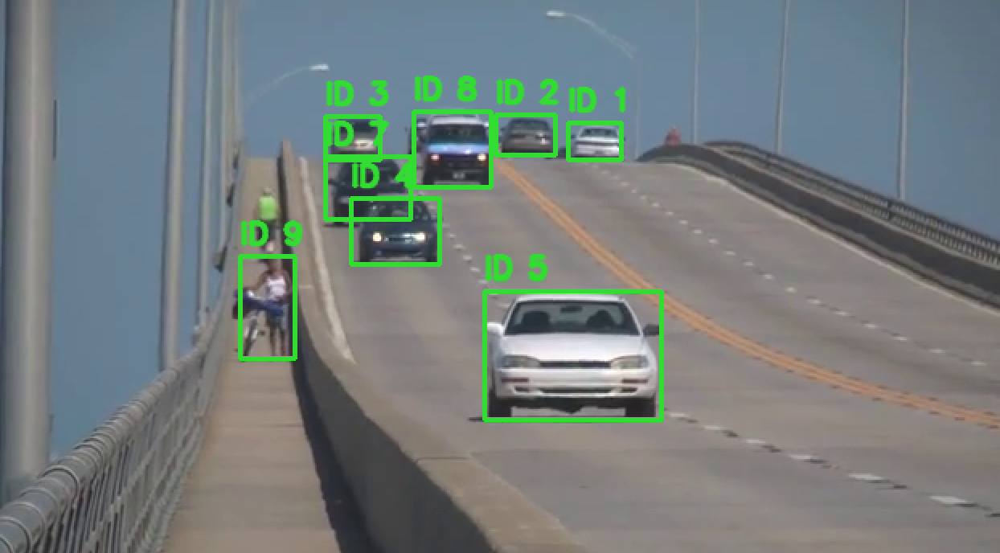
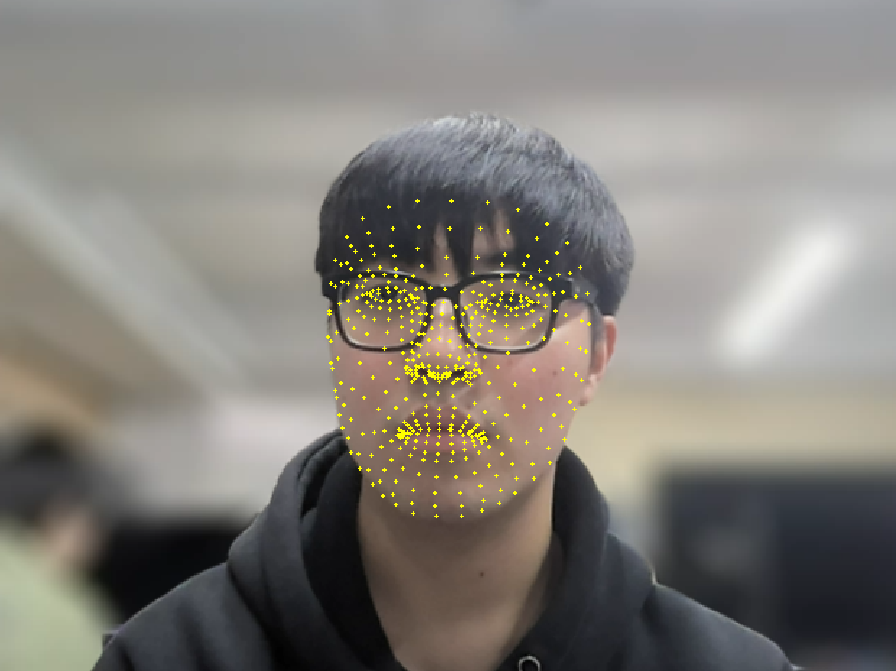

# L06 실습 - 컴퓨터 비전 과제: Tracking & Face Landmark

---

## 과제 1. SORT 알고리즘을 활용한 다중 객체 추적기 구현 (1.py)

YOLOv3로 프레임별 객체를 검출하고, SORT(칼만 필터 + 데이터 연관)를 이용해 객체 ID를 유지하며 추적하는 과제이다.

### 전체 코드

```python
import itertools  # 트랙 ID를 순차적으로 생성하기 위해 itertools를 불러옵니다.
from dataclasses import dataclass  # 트랙 상태를 간결하게 관리하기 위해 dataclass를 불러옵니다.
import cv2  # 영상 입출력, DNN, 칼만필터 처리를 위해 OpenCV를 불러옵니다.
import numpy as np  # 수치 연산과 배열 처리를 위해 NumPy를 불러옵니다.
try:  # scipy가 설치된 경우 Hungarian 알고리즘을 사용하기 위해 시도합니다.
    from scipy.optimize import linear_sum_assignment  # 최소 비용 매칭 함수(Hungarian)를 불러옵니다.
except Exception:  # scipy가 없는 환경에서도 코드가 동작하도록 예외를 처리합니다.
    linear_sum_assignment = None  # scipy 미설치 시 근사 매칭으로 대체하기 위해 None으로 둡니다.
def iou(box_a, box_b):  # 두 박스의 IoU를 계산하는 함수를 정의합니다.
    ax1, ay1, ax2, ay2 = box_a  # 첫 번째 박스 좌표를 분해합니다.
    bx1, by1, bx2, by2 = box_b  # 두 번째 박스 좌표를 분해합니다.
    inter_x1 = max(ax1, bx1)  # 교집합의 좌상단 x를 계산합니다.
    inter_y1 = max(ay1, by1)  # 교집합의 좌상단 y를 계산합니다.
    inter_x2 = min(ax2, bx2)  # 교집합의 우하단 x를 계산합니다.
    inter_y2 = min(ay2, by2)  # 교집합의 우하단 y를 계산합니다.
    inter_w = max(0.0, inter_x2 - inter_x1)  # 교집합 너비를 계산합니다.
    inter_h = max(0.0, inter_y2 - inter_y1)  # 교집합 높이를 계산합니다.
    inter_area = inter_w * inter_h  # 교집합 면적을 계산합니다.
    area_a = max(0.0, ax2 - ax1) * max(0.0, ay2 - ay1)  # 첫 번째 박스 면적을 계산합니다.
    area_b = max(0.0, bx2 - bx1) * max(0.0, by2 - by1)  # 두 번째 박스 면적을 계산합니다.
    union = area_a + area_b - inter_area  # 합집합 면적을 계산합니다.
    if union <= 0.0:  # 분모가 0 이하인 비정상 상황을 방지합니다.
        return 0.0  # 유효한 겹침이 없으므로 0을 반환합니다.
    return inter_area / union  # IoU를 반환합니다.
def greedy_assignment(cost_matrix):  # scipy가 없을 때 사용할 그리디 매칭 함수를 정의합니다.
    if cost_matrix.size == 0:  # 매칭할 항목이 없는 경우를 처리합니다.
        return np.empty((0, 2), dtype=int)  # 빈 매칭 결과를 반환합니다.
    pairs = []  # 매칭 쌍을 저장할 리스트를 초기화합니다.
    used_rows = set()  # 이미 사용한 검출 인덱스를 저장할 집합입니다.
    used_cols = set()  # 이미 사용한 트랙 인덱스를 저장할 집합입니다.
    flat_indices = np.argsort(cost_matrix, axis=None)  # 비용이 작은 순서대로 평탄 인덱스를 구합니다.
    cols = cost_matrix.shape[1]  # 열 개수를 저장합니다.
    for idx in flat_indices:  # 최소 비용부터 순회하며 매칭을 시도합니다.
        r = idx // cols  # 평탄 인덱스를 행 인덱스로 복원합니다.
        c = idx % cols  # 평탄 인덱스를 열 인덱스로 복원합니다.
        if r in used_rows or c in used_cols:  # 이미 배정된 행/열이면 건너뜁니다.
            continue  # 다음 후보로 이동합니다.
        used_rows.add(r)  # 현재 행을 사용 처리합니다.
        used_cols.add(c)  # 현재 열을 사용 처리합니다.
        pairs.append((r, c))  # 매칭 쌍을 저장합니다.
    return np.array(pairs, dtype=int)  # 매칭 결과를 배열로 반환합니다.
def assign_detections_to_tracks(detections, predicted_tracks, iou_threshold=0.3):  # 검출과 예측 트랙을 연관시키는 함수를 정의합니다.
    if len(predicted_tracks) == 0:  # 예측 트랙이 하나도 없는 경우를 처리합니다.
        return np.empty((0, 2), dtype=int), np.arange(len(detections)), np.empty((0,), dtype=int)  # 모든 검출을 미매칭으로 반환합니다.
    if len(detections) == 0:  # 검출 결과가 없는 경우를 처리합니다.
        return np.empty((0, 2), dtype=int), np.empty((0,), dtype=int), np.arange(len(predicted_tracks))  # 모든 트랙을 미매칭으로 반환합니다.
    iou_matrix = np.zeros((len(detections), len(predicted_tracks)), dtype=np.float32)  # 검출-트랙 IoU 행렬을 초기화합니다.
    for d_idx, det in enumerate(detections):  # 각 검출을 순회합니다.
        for t_idx, trk in enumerate(predicted_tracks):  # 각 트랙을 순회합니다.
            iou_matrix[d_idx, t_idx] = iou(det[:4], trk)  # 해당 쌍의 IoU를 저장합니다.
    cost_matrix = 1.0 - iou_matrix  # IoU를 비용으로 변환합니다.
    if linear_sum_assignment is not None:  # scipy Hungarian 알고리즘 사용 가능 여부를 확인합니다.
        row_idx, col_idx = linear_sum_assignment(cost_matrix)  # 최소 비용 매칭 인덱스를 계산합니다.
        matched = np.stack([row_idx, col_idx], axis=1) if len(row_idx) > 0 else np.empty((0, 2), dtype=int)  # 매칭 결과를 2열 배열로 구성합니다.
    else:  # scipy가 없으면 근사 방법으로 대체합니다.
        matched = greedy_assignment(cost_matrix)  # 그리디 매칭을 수행합니다.
    unmatched_dets = []  # 미매칭 검출을 저장할 리스트입니다.
    unmatched_trks = []  # 미매칭 트랙을 저장할 리스트입니다.
    valid_matches = []  # IoU 임계값을 만족한 유효 매칭을 저장합니다.
    matched_det_ids = set()  # 유효 매칭된 검출 인덱스를 저장합니다.
    matched_trk_ids = set()  # 유효 매칭된 트랙 인덱스를 저장합니다.
    for d_idx, t_idx in matched:  # 계산된 매칭 쌍을 순회합니다.
        if iou_matrix[d_idx, t_idx] < iou_threshold:  # IoU가 임계값보다 작으면 매칭을 거절합니다.
            unmatched_dets.append(d_idx)  # 해당 검출을 미매칭으로 기록합니다.
            unmatched_trks.append(t_idx)  # 해당 트랙을 미매칭으로 기록합니다.
            continue  # 다음 매칭 쌍으로 이동합니다.
        valid_matches.append((d_idx, t_idx))  # 임계값을 통과한 매칭을 기록합니다.
        matched_det_ids.add(d_idx)  # 검출 인덱스를 사용 처리합니다.
        matched_trk_ids.add(t_idx)  # 트랙 인덱스를 사용 처리합니다.
    for d_idx in range(len(detections)):  # 모든 검출 인덱스를 확인합니다.
        if d_idx not in matched_det_ids and d_idx not in unmatched_dets:  # 매칭/미매칭 기록이 없는 검출을 찾습니다.
            unmatched_dets.append(d_idx)  # 누락된 검출을 미매칭으로 추가합니다.
    for t_idx in range(len(predicted_tracks)):  # 모든 트랙 인덱스를 확인합니다.
        if t_idx not in matched_trk_ids and t_idx not in unmatched_trks:  # 매칭/미매칭 기록이 없는 트랙을 찾습니다.
            unmatched_trks.append(t_idx)  # 누락된 트랙을 미매칭으로 추가합니다.
    return np.array(valid_matches, dtype=int), np.array(unmatched_dets, dtype=int), np.array(unmatched_trks, dtype=int)  # 최종 연관 결과를 반환합니다.
def bbox_to_z(bbox):  # [x1,y1,x2,y2]를 칼만필터 측정값 [x,y,s,r]로 바꾸는 함수를 정의합니다.
    x1, y1, x2, y2 = bbox  # 입력 박스 좌표를 분해합니다.
    w = x2 - x1  # 박스 너비를 계산합니다.
    h = y2 - y1  # 박스 높이를 계산합니다.
    x = x1 + w / 2.0  # 중심 x를 계산합니다.
    y = y1 + h / 2.0  # 중심 y를 계산합니다.
    s = w * h  # 면적을 계산합니다.
    r = w / (h + 1e-6)  # 종횡비를 계산합니다.
    return np.array([x, y, s, r], dtype=np.float32)  # 측정 벡터를 반환합니다.
def x_to_bbox(state):  # 칼만필터 상태 [x,y,s,r,...]를 [x1,y1,x2,y2]로 바꾸는 함수를 정의합니다.
    x, y, s, r = state[0], state[1], max(1.0, state[2]), max(1e-6, state[3])  # 안정성을 위해 s,r 하한을 보정합니다.
    w = np.sqrt(s * r)  # 너비를 계산합니다.
    h = s / (w + 1e-6)  # 높이를 계산합니다.
    return np.array([x - w / 2.0, y - h / 2.0, x + w / 2.0, y + h / 2.0], dtype=np.float32)  # 모서리 좌표를 반환합니다.
@dataclass  # Track 클래스를 dataclass로 정의합니다.
class Track:  # 단일 객체 트랙 정보를 보관하는 클래스를 정의합니다.
    kf: cv2.KalmanFilter  # 칼만필터 객체를 저장합니다.
    track_id: int  # 고유 트랙 ID를 저장합니다.
    age: int = 0  # 생성 후 프레임 경과 수를 저장합니다.
    hits: int = 1  # 지금까지 업데이트된 횟수를 저장합니다.
    hit_streak: int = 1  # 연속 업데이트 횟수를 저장합니다.
    time_since_update: int = 0  # 마지막 업데이트 이후 경과 프레임을 저장합니다.
    @staticmethod  # 인스턴스 없이 호출 가능한 생성 헬퍼로 선언합니다.
    def create(initial_bbox, track_id):  # 초기 검출 박스로 Track을 생성하는 함수를 정의합니다.
        kf = cv2.KalmanFilter(7, 4)  # 상태 7차원, 측정 4차원 칼만필터를 생성합니다.
        kf.transitionMatrix = np.array(  # 상태 전이 행렬을 설정합니다.
            [  # 전이 행렬의 행 목록을 시작합니다.
                [1, 0, 0, 0, 1, 0, 0],  # x는 vx의 영향을 받습니다.
                [0, 1, 0, 0, 0, 1, 0],  # y는 vy의 영향을 받습니다.
                [0, 0, 1, 0, 0, 0, 1],  # s는 vs의 영향을 받습니다.
                [0, 0, 0, 1, 0, 0, 0],  # r은 정적 모델로 둡니다.
                [0, 0, 0, 0, 1, 0, 0],  # vx는 자기 자신을 유지합니다.
                [0, 0, 0, 0, 0, 1, 0],  # vy는 자기 자신을 유지합니다.
                [0, 0, 0, 0, 0, 0, 1],  # vs는 자기 자신을 유지합니다.
            ],  # 전이 행렬 목록을 종료합니다.
            dtype=np.float32,  # 행렬 타입을 float32로 지정합니다.
        )  # 전이 행렬 설정을 마칩니다.
        kf.measurementMatrix = np.array(  # 측정 행렬을 설정합니다.
            [  # 측정 행렬의 행 목록을 시작합니다.
                [1, 0, 0, 0, 0, 0, 0],  # 측정값 x를 상태 x에 연결합니다.
                [0, 1, 0, 0, 0, 0, 0],  # 측정값 y를 상태 y에 연결합니다.
                [0, 0, 1, 0, 0, 0, 0],  # 측정값 s를 상태 s에 연결합니다.
                [0, 0, 0, 1, 0, 0, 0],  # 측정값 r을 상태 r에 연결합니다.
            ],  # 측정 행렬 목록을 종료합니다.
            dtype=np.float32,  # 행렬 타입을 float32로 지정합니다.
        )  # 측정 행렬 설정을 마칩니다.
        kf.processNoiseCov = np.eye(7, dtype=np.float32) * 1e-2  # 프로세스 잡음 공분산을 설정합니다.
        kf.measurementNoiseCov = np.eye(4, dtype=np.float32) * 1e-1  # 측정 잡음 공분산을 설정합니다.
        kf.errorCovPost = np.eye(7, dtype=np.float32)  # 초기 오차 공분산을 단위행렬로 설정합니다.
        z = bbox_to_z(initial_bbox)  # 초기 박스를 측정 벡터로 변환합니다.
        kf.statePost = np.array([z[0], z[1], z[2], z[3], 0, 0, 0], dtype=np.float32).reshape(-1, 1)  # 초기 상태를 설정합니다.
        return Track(kf=kf, track_id=track_id)  # 초기화된 Track 객체를 반환합니다.
    def predict(self):  # 다음 상태를 예측하는 메서드를 정의합니다.
        self.kf.predict()  # 칼만필터 예측을 수행합니다.
        self.age += 1  # 트랙 나이를 1 증가시킵니다.
        self.time_since_update += 1  # 마지막 업데이트 경과 프레임을 1 증가시킵니다.
        if self.time_since_update > 0:  # 이번 프레임에 갱신 전이면 연속 갱신을 끊습니다.
            self.hit_streak = 0  # 연속 히트 수를 0으로 초기화합니다.
        return x_to_bbox(self.kf.statePre[:, 0])  # 예측 상태를 박스로 변환해 반환합니다.
    def update(self, bbox):  # 검출 결과로 트랙을 갱신하는 메서드를 정의합니다.
        measurement = bbox_to_z(bbox).reshape(-1, 1)  # 검출 박스를 측정 벡터로 변환합니다.
        self.kf.correct(measurement)  # 칼만필터 보정을 수행합니다.
        self.time_since_update = 0  # 마지막 업데이트 경과 프레임을 초기화합니다.
        self.hits += 1  # 총 히트 수를 증가시킵니다.
        self.hit_streak += 1  # 연속 히트 수를 증가시킵니다.
    def get_state_bbox(self):  # 현재 후행 상태를 박스로 얻는 메서드를 정의합니다.
        return x_to_bbox(self.kf.statePost[:, 0])  # 후행 상태를 박스로 변환해 반환합니다.
class SortTracker:  # 여러 트랙을 관리하는 SORT 추적기 클래스를 정의합니다.
    def __init__(self, max_age=15, min_hits=3, iou_threshold=0.3):  # 추적기 초기화 메서드를 정의합니다.
        self.max_age = max_age  # 갱신 없이 유지 가능한 최대 프레임 수를 저장합니다.
        self.min_hits = min_hits  # 출력 인정 최소 히트 수를 저장합니다.
        self.iou_threshold = iou_threshold  # 매칭에 사용할 IoU 임계값을 저장합니다.
        self.tracks = []  # 현재 활성 트랙 리스트를 초기화합니다.
        self.frame_count = 0  # 처리한 프레임 수를 초기화합니다.
        self._id_gen = itertools.count(1)  # 트랙 ID 생성기를 1부터 시작합니다.
    def update(self, detections):  # 한 프레임의 검출 결과로 추적기를 갱신하는 메서드를 정의합니다.
        self.frame_count += 1  # 프레임 카운트를 증가시킵니다.
        predicted = []  # 예측 박스를 담을 리스트를 초기화합니다.
        for trk in self.tracks:  # 기존 트랙들을 순회합니다.
            bbox = trk.predict()  # 각 트랙의 다음 상태를 예측합니다.
            predicted.append(bbox)  # 예측 박스를 리스트에 저장합니다.
        predicted = np.array(predicted, dtype=np.float32) if len(predicted) > 0 else np.empty((0, 4), dtype=np.float32)  # 예측 결과를 배열로 정리합니다.
        matches, unmatched_dets, unmatched_trks = assign_detections_to_tracks(  # 검출과 예측 트랙을 연관시킵니다.
            detections,  # 현재 프레임 검출값을 전달합니다.
            predicted,  # 예측 트랙 박스를 전달합니다.
            iou_threshold=self.iou_threshold,  # IoU 임계값을 전달합니다.
        )  # 연관 결과 계산을 마칩니다.
        for det_idx, trk_idx in matches:  # 유효 매칭 쌍을 순회합니다.
            self.tracks[trk_idx].update(detections[det_idx][:4])  # 매칭된 트랙을 검출 박스로 갱신합니다.
        for det_idx in unmatched_dets:  # 미매칭 검출을 순회합니다.
            new_track = Track.create(detections[det_idx][:4], next(self._id_gen))  # 새 트랙을 생성합니다.
            self.tracks.append(new_track)  # 트랙 리스트에 추가합니다.
        alive_tracks = []  # 유지할 트랙을 담을 리스트를 초기화합니다.
        results = []  # 화면 출력용 결과를 담을 리스트를 초기화합니다.
        for trk in self.tracks:  # 현재 트랙을 순회합니다.
            if trk.time_since_update <= self.max_age:  # 갱신 공백이 너무 길지 않은 트랙만 유지합니다.
                alive_tracks.append(trk)  # 살아있는 트랙 목록에 추가합니다.
            if trk.time_since_update == 0 and (trk.hits >= self.min_hits or self.frame_count <= self.min_hits):  # 출력 조건을 만족하는 트랙만 선택합니다.
                x1, y1, x2, y2 = trk.get_state_bbox()  # 현재 트랙 박스를 가져옵니다.
                results.append([x1, y1, x2, y2, trk.track_id])  # 박스와 ID를 결과 목록에 저장합니다.
        self.tracks = alive_tracks  # 만료된 트랙을 제거하고 활성 트랙만 유지합니다.
        if len(results) == 0:  # 결과가 없으면 빈 배열을 반환합니다.
            return np.empty((0, 5), dtype=np.float32)  # [x1,y1,x2,y2,id] 형식의 빈 배열을 반환합니다.
        return np.array(results, dtype=np.float32)  # 결과를 배열로 반환합니다.
def get_output_layer_names(net):  # YOLO 출력 레이어 이름을 가져오는 함수를 정의합니다.
    layer_names = net.getLayerNames()  # 전체 레이어 이름 목록을 가져옵니다.
    out_layers = net.getUnconnectedOutLayers()  # 출력 레이어 인덱스를 가져옵니다.
    out_layers = np.array(out_layers).reshape(-1)  # 인덱스 형태를 1차원으로 정리합니다.
    return [layer_names[idx - 1] for idx in out_layers]  # 1-based 인덱스를 이름으로 변환해 반환합니다.
def detect_objects(frame, net, output_layers, conf_threshold=0.5, nms_threshold=0.4):  # YOLO로 객체를 검출하는 함수를 정의합니다.
    h, w = frame.shape[:2]  # 프레임 높이와 너비를 얻습니다.
    blob = cv2.dnn.blobFromImage(frame, 1 / 255.0, (416, 416), swapRB=True, crop=False)  # 프레임을 YOLO 입력 블롭으로 변환합니다.
    net.setInput(blob)  # 네트워크 입력을 설정합니다.
    outputs = net.forward(output_layers)  # 출력 레이어를 forward 하여 검출 결과를 얻습니다.
    boxes = []  # 박스 목록을 초기화합니다.
    confidences = []  # 신뢰도 목록을 초기화합니다.
    for output in outputs:  # 출력 스케일별 결과를 순회합니다.
        for detection in output:  # 각 검출 벡터를 순회합니다.
            scores = detection[5:]  # 클래스 점수 구간을 추출합니다.
            class_id = int(np.argmax(scores))  # 최고 점수 클래스 인덱스를 구합니다.
            confidence = float(scores[class_id])  # 해당 클래스 신뢰도를 구합니다.
            if confidence < conf_threshold:  # 신뢰도 임계값보다 낮으면 제외합니다.
                continue  # 다음 검출로 이동합니다.
            center_x = int(detection[0] * w)  # 중심 x를 픽셀 좌표로 변환합니다.
            center_y = int(detection[1] * h)  # 중심 y를 픽셀 좌표로 변환합니다.
            bw = int(detection[2] * w)  # 박스 너비를 픽셀로 변환합니다.
            bh = int(detection[3] * h)  # 박스 높이를 픽셀로 변환합니다.
            x1 = int(center_x - bw / 2)  # 좌상단 x를 계산합니다.
            y1 = int(center_y - bh / 2)  # 좌상단 y를 계산합니다.
            boxes.append([x1, y1, bw, bh])  # NMS용 박스를 저장합니다.
            confidences.append(confidence)  # 신뢰도를 저장합니다.
    idxs = cv2.dnn.NMSBoxes(boxes, confidences, conf_threshold, nms_threshold)  # NMS를 수행해 중복 박스를 제거합니다.
    detections = []  # 최종 검출 목록을 초기화합니다.
    if len(idxs) > 0:  # NMS 통과 박스가 있으면 처리합니다.
        for i in np.array(idxs).reshape(-1):  # 인덱스를 1차원으로 변환해 순회합니다.
            x, y, bw, bh = boxes[i]  # 선택된 박스 정보를 꺼냅니다.
            x1 = max(0, x)  # 영상 경계를 벗어나지 않도록 x1을 보정합니다.
            y1 = max(0, y)  # 영상 경계를 벗어나지 않도록 y1을 보정합니다.
            x2 = min(w - 1, x + bw)  # 영상 경계를 벗어나지 않도록 x2를 보정합니다.
            y2 = min(h - 1, y + bh)  # 영상 경계를 벗어나지 않도록 y2를 보정합니다.
            detections.append([x1, y1, x2, y2, confidences[i]])  # [x1,y1,x2,y2,conf] 형식으로 저장합니다.
    if len(detections) == 0:  # 검출이 없으면 빈 배열을 반환합니다.
        return np.empty((0, 5), dtype=np.float32)  # 검출 결과가 비었음을 나타냅니다.
    return np.array(detections, dtype=np.float32)  # 검출 배열을 반환합니다.
def main():  # 프로그램 진입 함수입니다.
    cfg_path = "yolov3.cfg"  # YOLOv3 설정 파일 경로를 지정합니다.
    weights_path = "yolov3.weights"  # YOLOv3 가중치 파일 경로를 지정합니다.
    video_path = "slow_traffic_small.mp4"  # 입력 비디오 파일 경로를 지정합니다.
    net = cv2.dnn.readNetFromDarknet(cfg_path, weights_path)  # Darknet 형식 모델을 로드합니다.
    output_layers = get_output_layer_names(net)  # 출력 레이어 이름을 가져옵니다.
    cap = cv2.VideoCapture(video_path)  # 비디오 캡처를 엽니다.
    if not cap.isOpened():  # 비디오 열기 실패 여부를 확인합니다.
        print("비디오를 열 수 없습니다:", video_path)  # 실패 메시지를 출력합니다.
        return  # 함수 실행을 종료합니다.
    tracker = SortTracker(max_age=20, min_hits=3, iou_threshold=0.3)  # SORT 추적기를 생성합니다.
    while True:  # 비디오 프레임을 반복 처리합니다.
        ok, frame = cap.read()  # 프레임을 한 장 읽습니다.
        if not ok:  # 더 이상 프레임이 없으면 종료합니다.
            break  # 루프를 빠져나갑니다.
        detections = detect_objects(frame, net, output_layers, conf_threshold=0.5, nms_threshold=0.4)  # 현재 프레임 객체를 검출합니다.
        tracked = tracker.update(detections)  # 검출 결과로 추적 상태를 갱신합니다.
        for x1, y1, x2, y2, track_id in tracked:  # 추적 결과를 순회합니다.
            x1, y1, x2, y2, track_id = int(x1), int(y1), int(x2), int(y2), int(track_id)  # 그리기용 정수 좌표로 변환합니다.
            cv2.rectangle(frame, (x1, y1), (x2, y2), (50, 220, 50), 2)  # 추적 박스를 프레임에 그립니다.
            cv2.putText(  # 트랙 ID 텍스트를 프레임에 표시합니다.
                frame,  # 텍스트를 그릴 대상 프레임입니다.
                f"ID {track_id}",  # 표시할 텍스트 문자열입니다.
                (x1, max(15, y1 - 8)),  # 텍스트 위치를 설정합니다.
                cv2.FONT_HERSHEY_SIMPLEX,  # OpenCV 기본 폰트를 사용합니다.
                0.6,  # 글자 크기를 지정합니다.
                (50, 220, 50),  # 글자 색상을 지정합니다.
                2,  # 글자 두께를 지정합니다.
                cv2.LINE_AA,  # 안티앨리어싱을 적용합니다.
            )  # 텍스트 표시를 마칩니다.
        cv2.imshow("SORT Multi Object Tracking", frame)  # 결과 프레임을 화면에 표시합니다.
        if cv2.waitKey(1) & 0xFF == 27:  # ESC 키 입력을 확인합니다.
            break  # ESC가 눌리면 루프를 종료합니다.
    cap.release()  # 비디오 캡처 리소스를 해제합니다.
    cv2.destroyAllWindows()  # OpenCV 창을 모두 닫습니다.
if __name__ == "__main__":  # 현재 파일이 직접 실행된 경우를 확인합니다.
    main()  # 메인 함수를 실행합니다.

```

### 핵심 코드

**1) YOLOv3 객체 검출 + NMS**

프레임에서 바운딩 박스를 추출하고 신뢰도 기준으로 필터링한 뒤 NMS로 중복 박스를 제거한다.

```python
blob = cv2.dnn.blobFromImage(frame, 1 / 255.0, (416, 416), swapRB=True, crop=False)
net.setInput(blob)
outputs = net.forward(output_layers)
idxs = cv2.dnn.NMSBoxes(boxes, confidences, conf_threshold, nms_threshold)
```

**2) SORT 데이터 연관(매칭)**

검출 박스와 예측 트랙 박스의 IoU 행렬을 만들고 Hungarian(또는 그리디 fallback)으로 연관한다.

```python
iou_matrix[d_idx, t_idx] = iou(det[:4], trk)
cost_matrix = 1.0 - iou_matrix
row_idx, col_idx = linear_sum_assignment(cost_matrix)
```

**3) 칼만 필터 기반 추적 상태 업데이트**

트랙 예측 후 매칭된 항목은 보정(update)하고, 미매칭 검출은 새 트랙으로 생성한다.

```python
bbox = trk.predict()
self.tracks[trk_idx].update(detections[det_idx][:4])
new_track = Track.create(detections[det_idx][:4], next(self._id_gen))
```

최종결과


---

## 과제 2. Mediapipe를 활용한 얼굴 랜드마크 추출 및 시각화 (2.py)

MediaPipe FaceMesh를 사용해 웹캠 영상에서 얼굴 랜드마크를 검출하고 실시간으로 점 시각화를 수행하는 과제이다.

### 전체 코드

```python
import cv2  # 웹캠 입력과 시각화를 위해 OpenCV를 불러옵니다.
import mediapipe as mp  # 얼굴 랜드마크 검출을 위해 MediaPipe를 불러옵니다.
def main():  # 프로그램 메인 함수를 정의합니다.
    mp_face_mesh = mp.solutions.face_mesh  # FaceMesh 모듈 참조를 저장합니다.
    cap = cv2.VideoCapture(0)  # 기본 웹캠(인덱스 0)을 엽니다.
    if not cap.isOpened():  # 웹캠 열기 성공 여부를 확인합니다.
        print("웹캠을 열 수 없습니다.")  # 웹캠 실패 시 안내 메시지를 출력합니다.
        return  # 더 진행하지 않고 종료합니다.
    with mp_face_mesh.FaceMesh(
        static_image_mode=False,
        max_num_faces=1,
        refine_landmarks=True,
        min_detection_confidence=0.5,
        min_tracking_confidence=0.5,
    ) as face_mesh:
        while True:
            ok, frame = cap.read()
            if not ok:
                break
            frame = cv2.flip(frame, 1)
            rgb = cv2.cvtColor(frame, cv2.COLOR_BGR2RGB)
            results = face_mesh.process(rgb)
            if results.multi_face_landmarks:
                h, w = frame.shape[:2]
                for face_landmarks in results.multi_face_landmarks:
                    for lm in face_landmarks.landmark:
                        x = int(lm.x * w)
                        y = int(lm.y * h)
                        cv2.circle(frame, (x, y), 1, (0, 255, 255), -1)
            cv2.imshow("MediaPipe FaceMesh", frame)
            if cv2.waitKey(1) & 0xFF == 27:
                break
    cap.release()
    cv2.destroyAllWindows()
if __name__ == "__main__":
    main()
```

### 핵심 코드

**1) FaceMesh 초기화**

실시간 영상 처리 모드에서 얼굴 랜드마크 검출기를 초기화한다.

```python
with mp_face_mesh.FaceMesh(
    static_image_mode=False,
    max_num_faces=1,
    refine_landmarks=True,
    min_detection_confidence=0.5,
    min_tracking_confidence=0.5,
) as face_mesh:
```

**2) 정규화 좌표를 픽셀 좌표로 변환**

검출된 랜드마크는 0~1 정규화 좌표이므로 이미지 크기에 맞게 픽셀 좌표로 변환해 사용한다.

```python
x = int(lm.x * w)
y = int(lm.y * h)
```

**3) 랜드마크 시각화 및 종료 키 처리**

각 랜드마크를 점으로 그려 표시하고 ESC 키 입력 시 종료한다.

```python
cv2.circle(frame, (x, y), 1, (0, 255, 255), -1)
if cv2.waitKey(1) & 0xFF == 27:
    break
```

최종결과


---

## 실행 방법

```bash
# E06 폴더로 이동
cd E06

# 가상환경 생성(최초 1회)
python -m venv .venv

# 가상환경 활성화 (PowerShell)
.\.venv\Scripts\Activate.ps1

# 패키지 설치
pip install mediapipe==0.10.9 opencv-python==4.10.0.84 numpy==1.26.4 scipy

# 과제 실행
python 1.py
python 2.py
```

---

## 정리

6장 실습은 객체의 위치를 프레임 간 연속적으로 유지하는 다중 객체 추적(SORT)과, 얼굴의 세밀한 형상을 점 단위로 표현하는 랜드마크 추출(FaceMesh)을 구현하는 과제이다. 1.py에서는 YOLOv3 검출 결과를 SORT 추적기에 연결해 객체별 ID를 유지하고, 2.py에서는 웹캠 실시간 영상에서 얼굴 랜드마크를 추출해 즉시 시각화한다.
